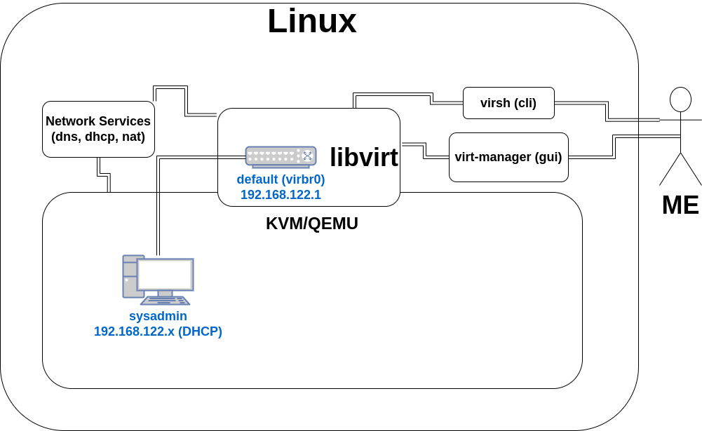

In this initial lab, I'll install `libvirt`, `QEMU`, and `virt-manager` for my virtual machine (VM) lab infrastructure. I'll also use a command line tool provided by `libvirt` called `virsh` to edit a virtual network.

By default, when I install the VM software, a virtual network called `default` will be created. I'll also create two virtual machines (VMs) and connect them to that `default` network, and have them communicate with each other.

One VM will be called `sysadmin`. It will have the CentOS Stream 9 Linux operating system installed, with a virtual network interface card (NIC) connected to the `default` network, using the DHCP service provided by that network to get a IPv4 address for that NIC, and it will have the GNOME desktop environment installed.

The other VM will be called `juicero`. It will also have CentOS Stream 9 Linux installed. It will also have a NIC connected to the `default` network, but I'll give it a static IP address. And it won't need a desktop environment. Most of the time, I will manage it from the `sysadmin` VM via its SSH service.

By the end of this lab, I'll test that I am able to communicate between the VMs via the `default` virtual network, and that I can refer to the `juicero` VM by its hostname, and not just its IPv4 address.

Here's a diagram of what this lab will have:

In the first step, I'll install the software that will help make managing the VMs an virtual networks easier: `qemu`, `libvirt`, and `virt-manager`.