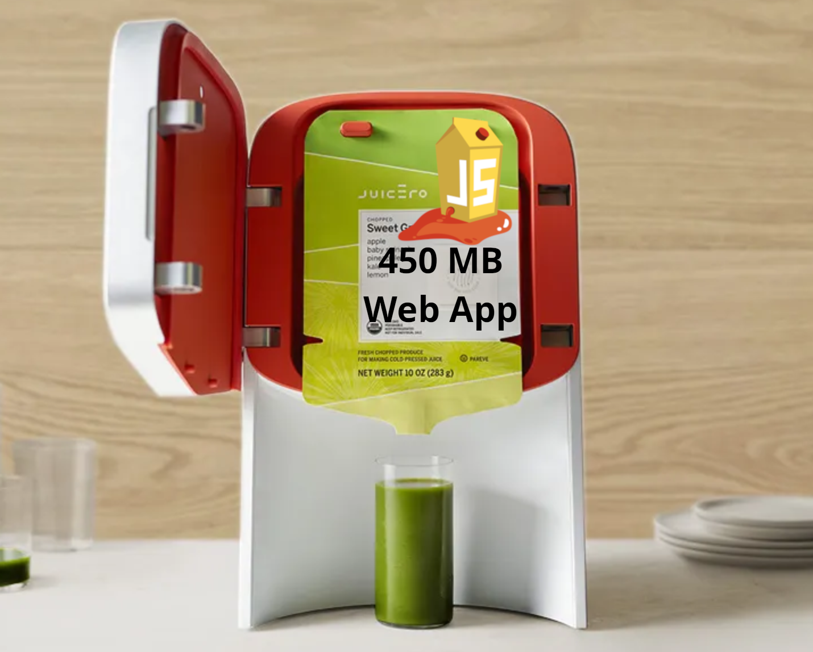

## Intro
In this lab, I'm going to install the OWASP vulnerable web application Juice Shop on a [CentOS Linux](https://centos.org/) VM. I'll also use a CentOS workstation as a desktop computer for a systems administrator. I'll use that to manage the Juice Shop web application server. I'm going to configure the juicero VM to run like a server, so that the web application automatically runs when the server turns on.

I'll be using this VM in other cybersecurity labs.

## Why install this vulnerable web application?
I want to use this in later cybersecurity labs. There is [official documentation](https://pwning.owasp-juice.shop/companion-guide/latest/appendix/solutions.html) that explains how you can exploit the vulnerabilities. There's also many YouTube videos showing how to use penetration testing techniques and tools, like these [YouTube videos by Hacksplained](https://youtu.be/0YSNRz0NRt8?si=gwEorYl-xo6-CBe0).

## Why create a VM server?
The goal for these labs was for me to gain a little experience doing systems administrator tasks on Linux machines. Particularly cybersecurity things like securing servers. I've seen YouTube interviews with cybersecurity professionals who say a big problem with people entering cybersecurity is that they don't have enough background in IT basics.

So I structured these labs to learn both cybersecurity concepts (in the case of the OWASP Juice Shop web app, web vulnerabilities) and IT admin fundamentals.

But you can setup the OWASP juice-shop web application on your computer without the virtual machine software setup or any virtual machines. They provide different [installation options](https://github.com/juice-shop/juice-shop#setup), including installing it as a [Docker container](https://github.com/juice-shop/juice-shop#docker-container).

However, in the tradition of the original [Juicero](https://en.wikipedia.org/wiki/Juicero), this will be an overengineered solution to a simple problem.

