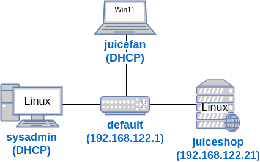
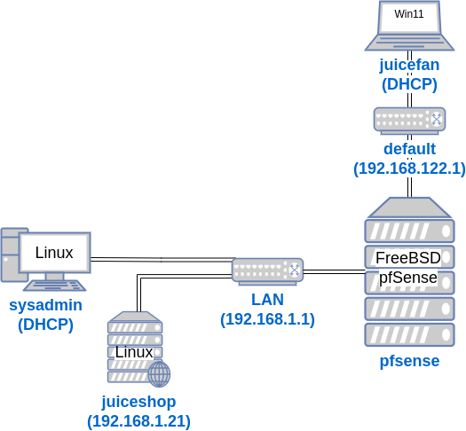

## Intro
In a previous lab I cloned some Linux and Windows 11 VMs to create three VMs: `juiceshop`, `sysadmin`, and `juicefan`. The `juiceshop` VM is a Linux server running the vulnerable web application by OWASP called [Juice Shop](https://owasp.org/www-project-juice-shop/). The `sysadmin` was a Linux desktop that managed the `juiceshop` server via SSH. And the `juicefan` was a Windows desktop with a customer using the Juice Shop web application on the `juiceshop` VM.

The VMs all had virtual network interface cards connected to the default virtual network. Here's a diagram of that setup at the end of the lab:

In this lab, I want to add a firewall server VM called `pfsense` that will be a gateway between the Juice Shop customer on `juicefan` and the VMs used to manage the Juice Shop web application: `sysadmin` and `juiceshop`.

I'll use the libvirt library to create an isolated virtual network called `LAN`. Here's what the lab will look like:

TODO: finish documentation
## Why install a firewall?

## VM Lab Environment