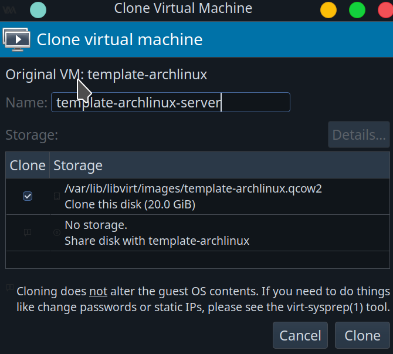
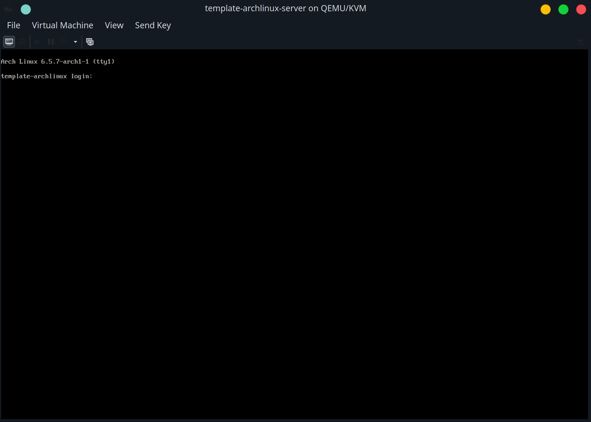

## Intro
This is just a short lab where I take the `tempate-archlinux` VM I made in [Lab 01](../01-template-archlinux-vm/) and clone it to create a server version that starts in console mode. I'll use it for VMs that just run servers, in case I want to add a server to a lab I'm working on.

I'll use systemd-networkd to manage the network interface rather than NetworkManager. I could use NetworkManager without using the KDE Plasma window manager, just in console mode. But I like editing the Ethernet device configuration file rather than using the nmcli command line tool to change NetworkManager settings.

With servers, I'll usually set a static IP, rather than getting an IP via DHCP. So I'll add a bash alias short cut for editing that file. I'll add other bash aliases that are commonly used when managing servers.

## Create template-archlinux-server VM
I clone the `template-archlinux` VM to create a `template-archlinux-server` VM.


## Disable SDDM GUI Startup
I'll just use the VM to start services, like web application. So I'll disable SDDM so it doesn't start X11 and just goes into terminal mode.
```
sudo systemctl disable sddm
```
Then, I restart to check that it just starts with the normal console.


## Increase Console Font Size
I feel like the text is too small. I may want to read log data or something later on. So, I install the `terminus-font` package and set the font size for the console to the larger `ter-122b` with the command `setfont ter-122b`. I can try other larger sizes, like `ter-124b`, but I like that one. You can list the other terminus fonts with `ls /usr/share/kbd/consolefonts/ter-*`.

To make that font the permenent console font, edit the `/etc/vconsole.conf` file and add a line saying `FONT=ter-122b`.

## Use systemd-networkd instead of NetworkManager
I like using the `systemd-networkd` instead of NetworkManager if it's just console Linux. I can just edit a file, and I don't need to use the `NetworkManager` command line tool `nmcli`. It's not difficult to use, but it's just easier to edit a file.

**NOTE: This isn't necessary, I just like using it better than NetworkManager when I'm not using a windows manager.**

I've used the `Netplan` service on Ubuntu a few times, and that's also pretty cool with the YAML configuration. But I'll just choose `systemd-networkd` for this VM template.

The instructions I found on the blog [here](https://linux.fernandocejas.com/docs/how-to/switch-from-network-manager-to-systemd-networkd) were very helpful.

### Disable NetworkManager Service
First, I stop and disable the `NetworkManager` service:
```
sudo systemctl stop NetworkManager
sudo systemctl disable NetworkManager
```

### Enable systemd-networkd Service
Next, I enable to `systemd-networkd` service:
```
sudo systemctl enable systemd-networkd
```

## Create Network Connection Configuration File
I'm always using VMs with a virtual Ethernet network interface device. And it's either using DHCP or a static IP, and a gateway server, or DNS server. So I think it's easier to edit a file to change those configurations.

With the `systemd-networkd`, the network interface device's configuration should be set in the directory `/etc/systemd/network`, with the file name following the format `##-devicename.network`, with `devicename` being the network interface device name you would find in the `/dev` directory.

I can get the device name by running `ip a`. It's name is `enp1s0`.


So, I create a file called `/etc/systemd/network/00-enp1s0.network` and write this:
```
[Match]
Name=enp1s0

[Network]
#Address=192.168.122.20/24
#Gateway=192.168.122.1
DNS=192.168.122.1
DHCP=ipv4
```

This sets the `enp1s0` network interface to use DHCP to get an IPv4 address, and comments out the Address line with the value `192.18.122.20/24`, setting the gateway and DNS server values `192.168.122.1`. That IP is used by the default virtual network that I've connected this VM's network interface to.

If I connect it to a different virtual network, I'll edit this file to use the different network addresses.

If I stop using DHCP and give it a static IP, I can edit that `00-enp1s0.network` file to say this:
```
[Match]
Name=enp1s0

[Network]
Address=192.168.122.20/24
Gateway=192.168.122.1
DNS=192.168.122.1
#DHCP=no
```

That will configure the network interface to use the static IP address of `192.18.122.20/24`.

## Test Clone
I'll create a clone of the `template-archlinux-server` VM and call it `clone-server`.

I was able to ping `clone-server`'s DHCP IP from my host computer, since they were both connected to the default virtual network. When I edited the network interface configuration file to use the static IP address `192.168.122.99`, and restarted the `systemd-networkd` service, I was able to ping it at that new static IP address.

In the template VM, I added an alias to the `.bashrc` file that opens vim to edit the network interface configuration file:
```
alias edit_net="sudo vim /etc/systemd/network/00-enp1s0.network"
```

## Conclusion
This was just creating a template VM from the other Arch Linux template VM, for when I want to have a server Linux VM and I don't need a desktop.