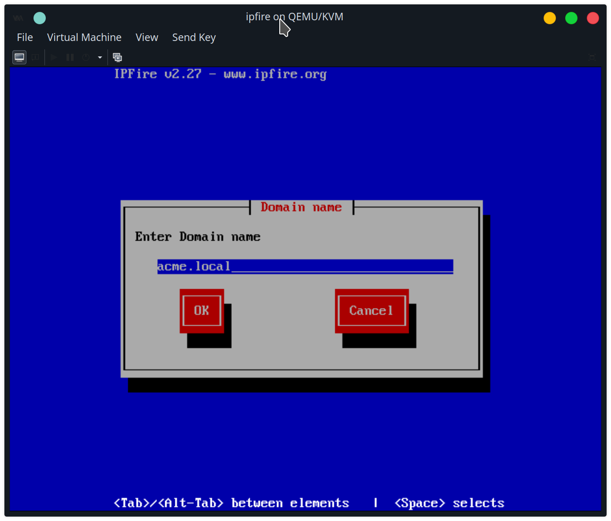
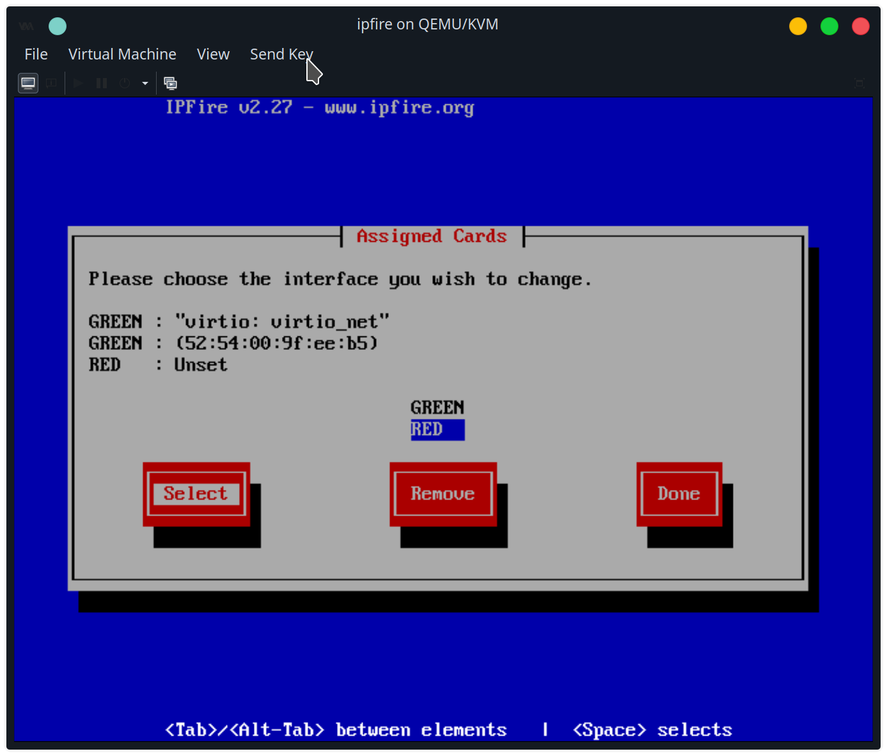
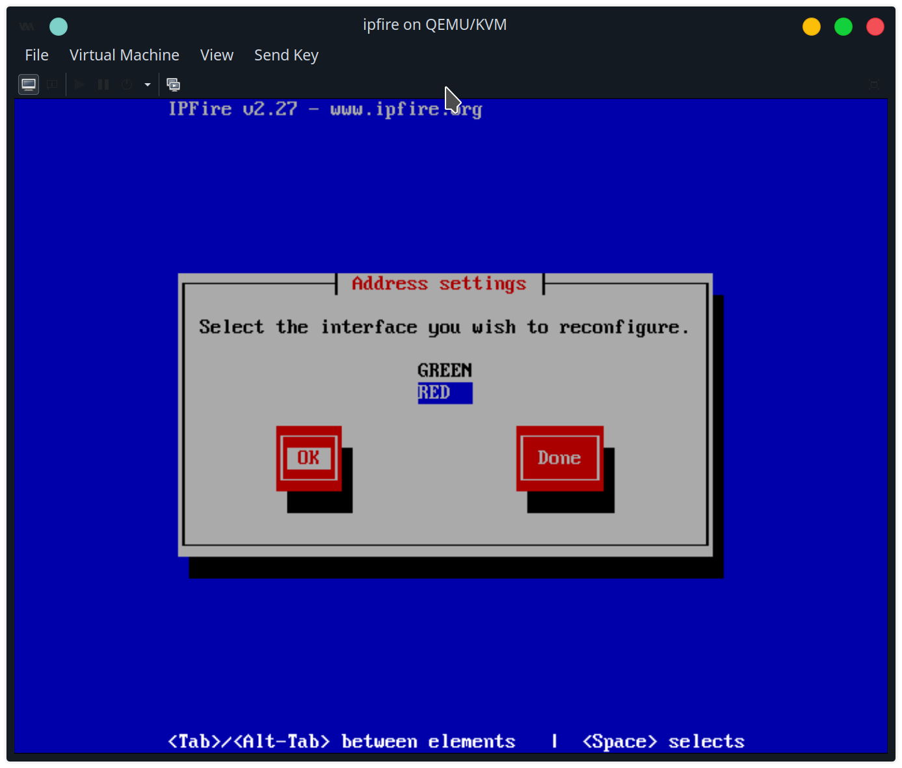
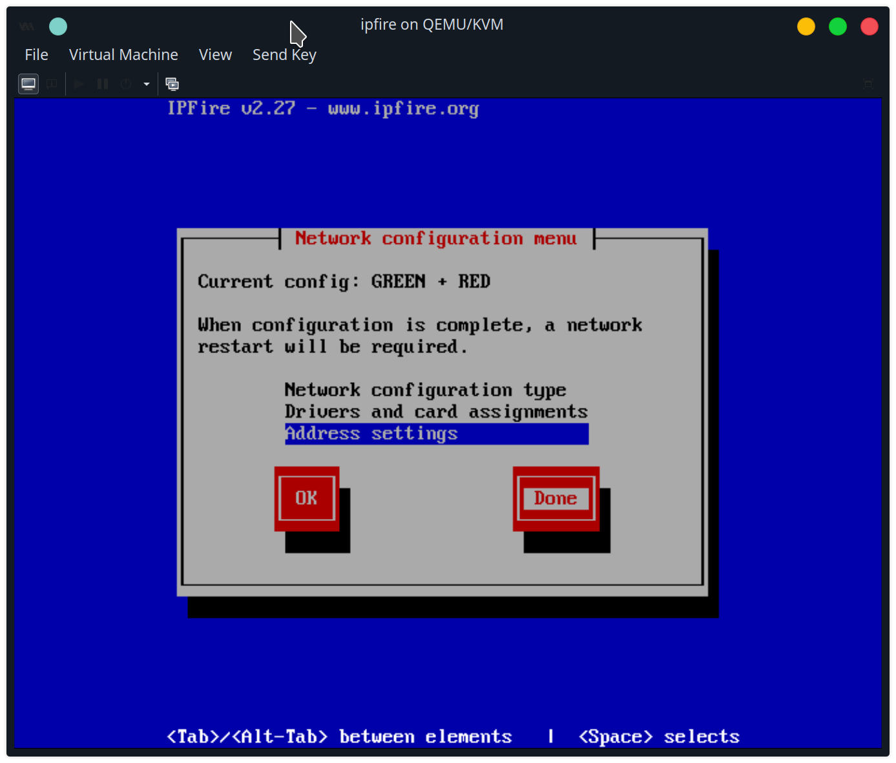

## Create ipfire VM
I download the IPFire ISO on its download page [https://www.ipfire.org/download/ipfire-2.27-core180](https://www.ipfire.org/download/ipfire-2.27-core180).

I create a new `ipfire` VM with 4GB RAM, 2 CPUs, and 25 GB storage. I check customize configuration to add another NIC before installing.

It has two NICs:
One is connected to the `default` network, and has the MAC address `52:54:00:ad:f1:77`.
The other is connected to the `LAN` network, and has the MAC address `52:54:00:9f:ee:b5`.

The def

I begin the installation:

I go through the installation process, installing an ext4 filesystem for the Linux operating system. It needs to reboot, then I can setup the firewall.

I name the hostname `ipfire`.

I give it the `acme.local` domain name, but I'll need to setup the `acme-dc` as the domain controller for that after this firewall is setup.

I give it a root password and admin password. The root account is used to log into the system, and the admin account is used in the GUI web admin tool.

Asks for root password and admin (web admin) passwords.

Using GREEN + RED configuration type:

Next, go to `Drivers and card assignments`:

Configure GREEN (LAN)

Configure RED (WAN)

Both set

set addresses

Configure GREEN
Warning:

Configure RED

**TODO: Add screenshot connecting NIC to RED/WAN using DHCP **

Done

DHCP Server, ranges, using 192.168.1.21 as primary DNS and 192.168.122.1 as secondary. Later, when I setup the Active Directory domain controller at 192.168.1.21, it will have a DNS server running.

Now setup is complete, and it restarts.

ip addresses, red and green

Next, setup the domain controller. 

