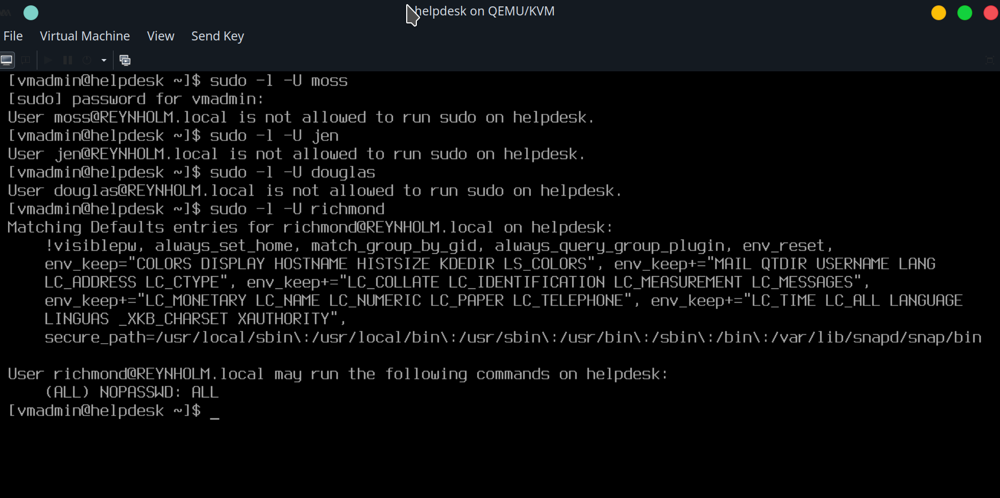

Editing the `sssd.conf` file to add this:
```
default_domain_suffix = REYNHOLM.local
```

To give it-admin sudo access, create a sudoers file for the group at `/etc/sudoers.d/it_admin_sudo`:
```
%it-admin ALL=(ALL) NOPASSWD:ALL
```

Change permission for root:
```
sudo chown root:root /etc/sudoers.d/domain_group_sudo
sudo chmod 0440 /etc/sudoers.d/domain_group_sudo
```

Now, the only `reynholm.local` domain users in the `IT-Admin` domain group can  sudo on `helpdesk`.

Checking other domain users, including ones in the `IT-Staff` domain group like `jen` and `moss`, don't have sudo access. Just the ones in the `IT-Admin` group: `richmond`:


