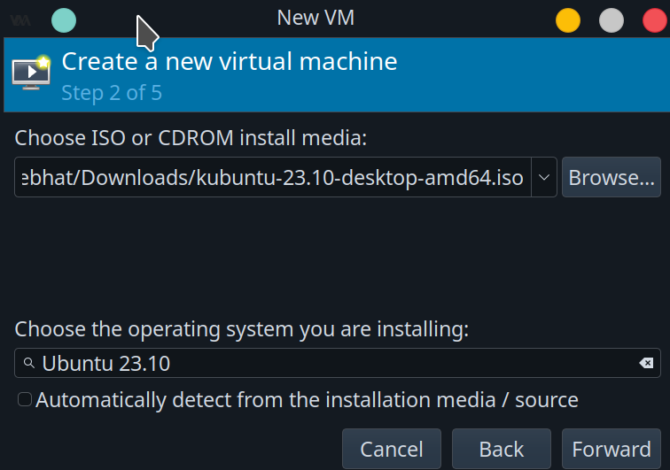
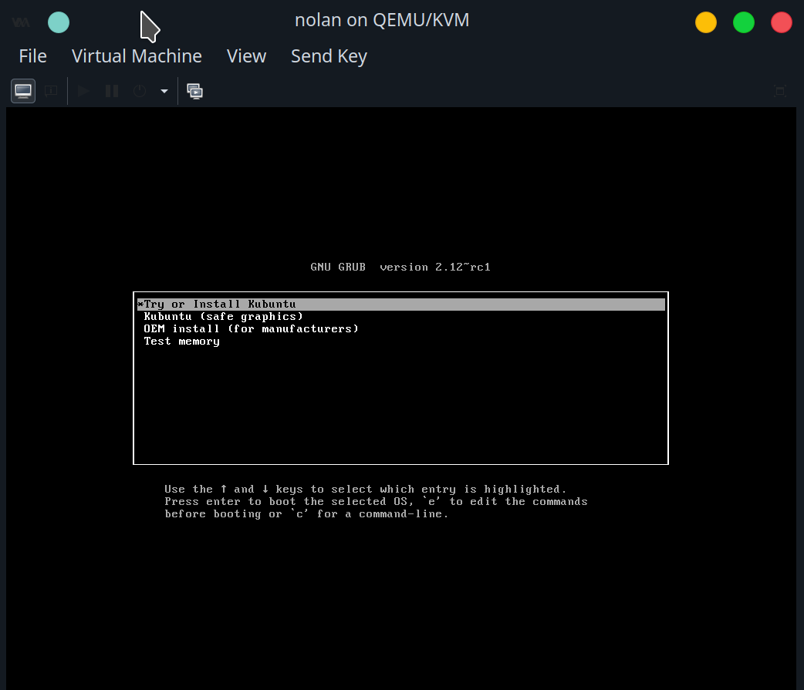
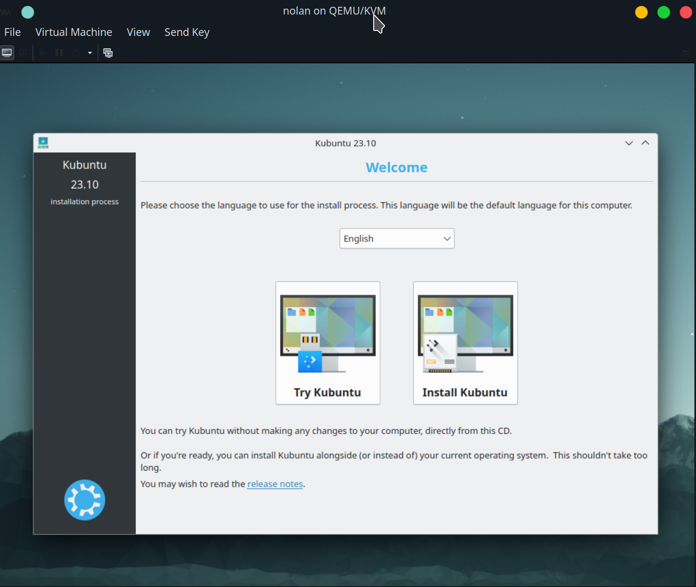
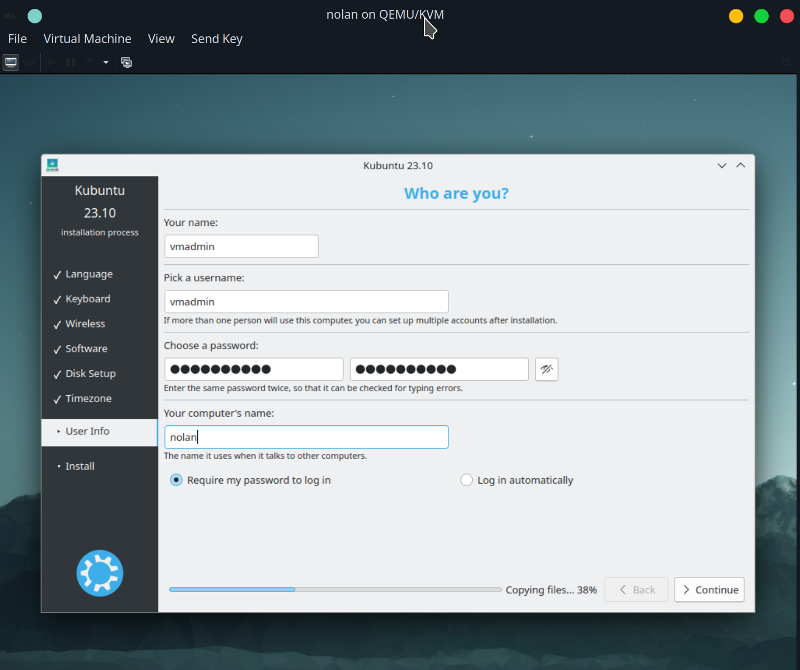
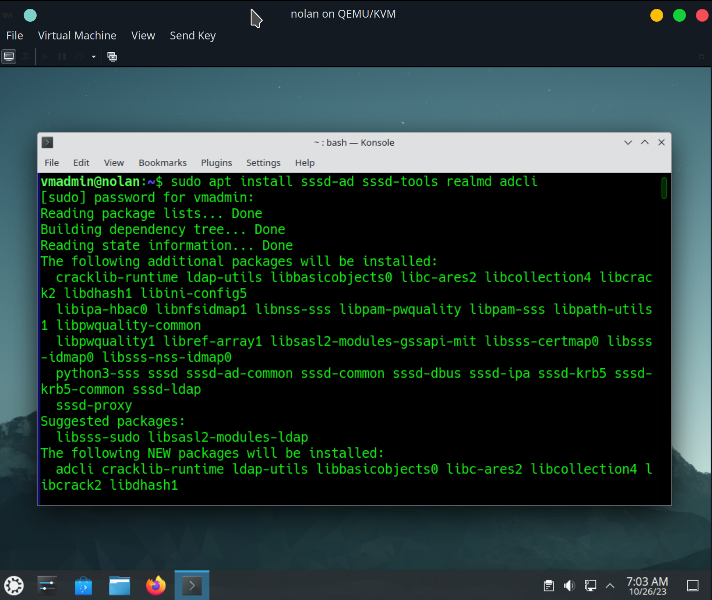
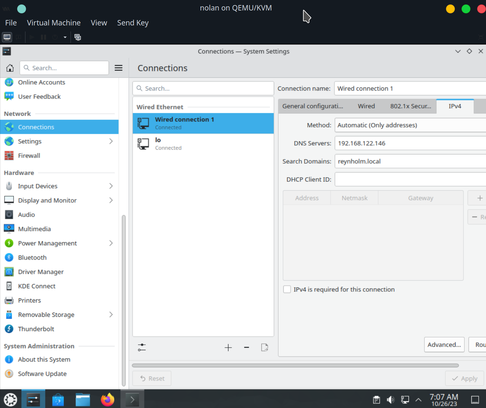

Install `nolan` VM with Kubuntu.










The `systemd-resolved` service should be stopped and disabled, and the `/etc/resolv.conf` file unlinked. Otherwise, it will be used for dns services. Re-create the `/etc/resolv.conf` file with the `nameserver` and `search` configured:
```
nameserver DOMAIN-CONTROLLER-IP
search REYNHOLM.local
```

