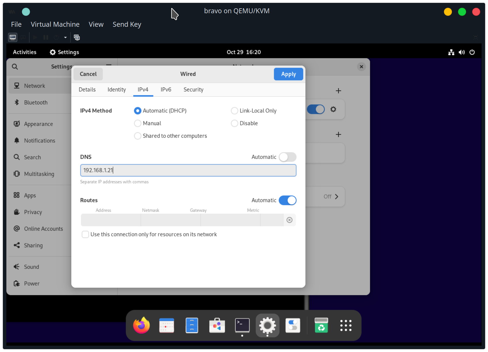
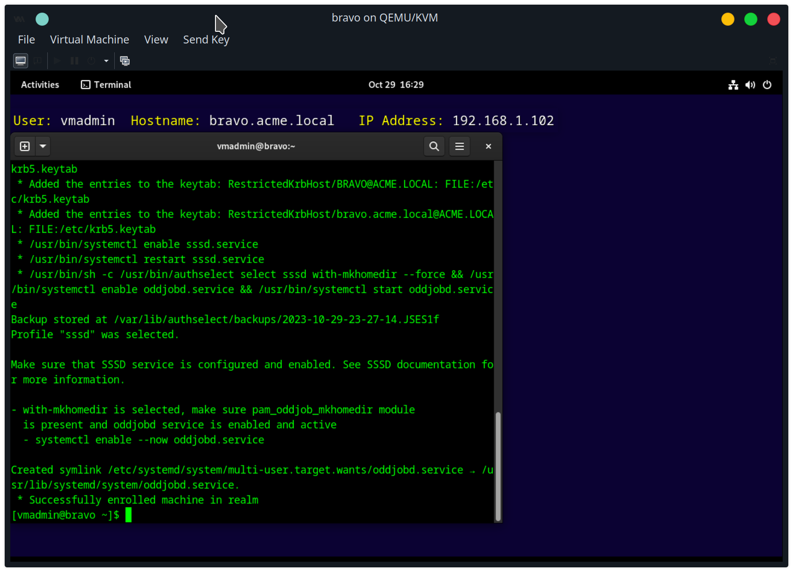
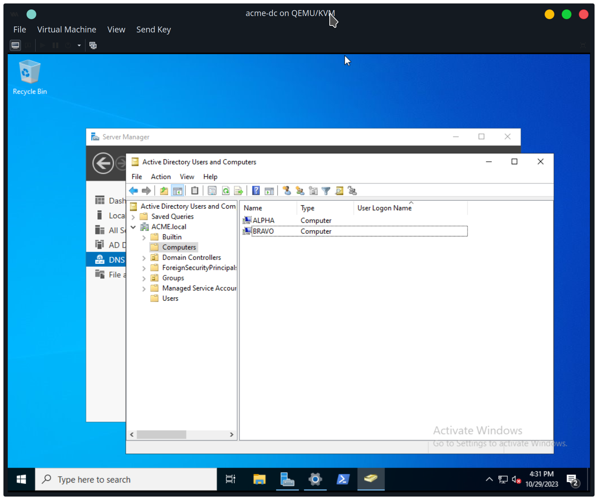
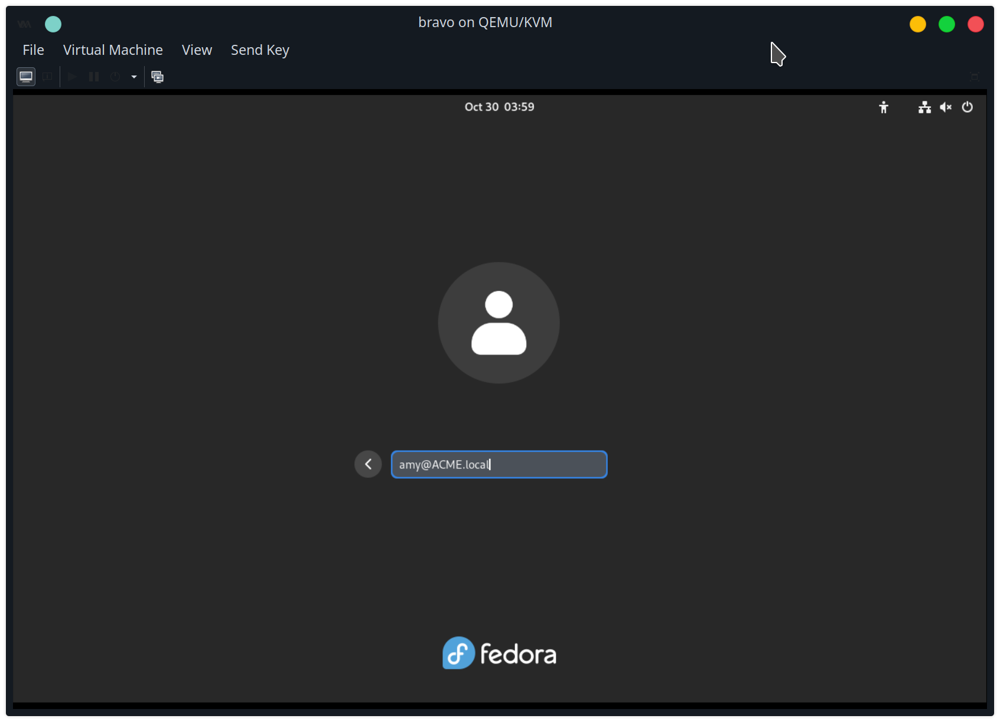

change hostname to bravo.acme.local
```
sudo hostnamectl set-hostname bravo.acme.local
```

Change DNS



To prevent systemd-resolved from interfering, disable:
```
sudo systemctl stop systemd-resolved
sudo systemctl disable systemd-resolved
sudo unlink /etc/resolv.conf
```

Create new /etc/resolv.conf
```
nameserver 192.168.1.21
search ACME.local
```
restart VM

install packages
```
sudo dnf install realmd sssd oddjob oddjob-mkhomedir adcli samba-common-tools -y
```

```
sudo realm discover ACME.local -v
```


```
sudo realm join ACME.local -v
```




get user from passwd db
```
getent passwd bob@acme.local
```

enable default suffix


get user from passwd db without `@acme.local`
```
getent passwd bob
```

Click "not listed"


login as amy@ACME.local (case sensitive)



