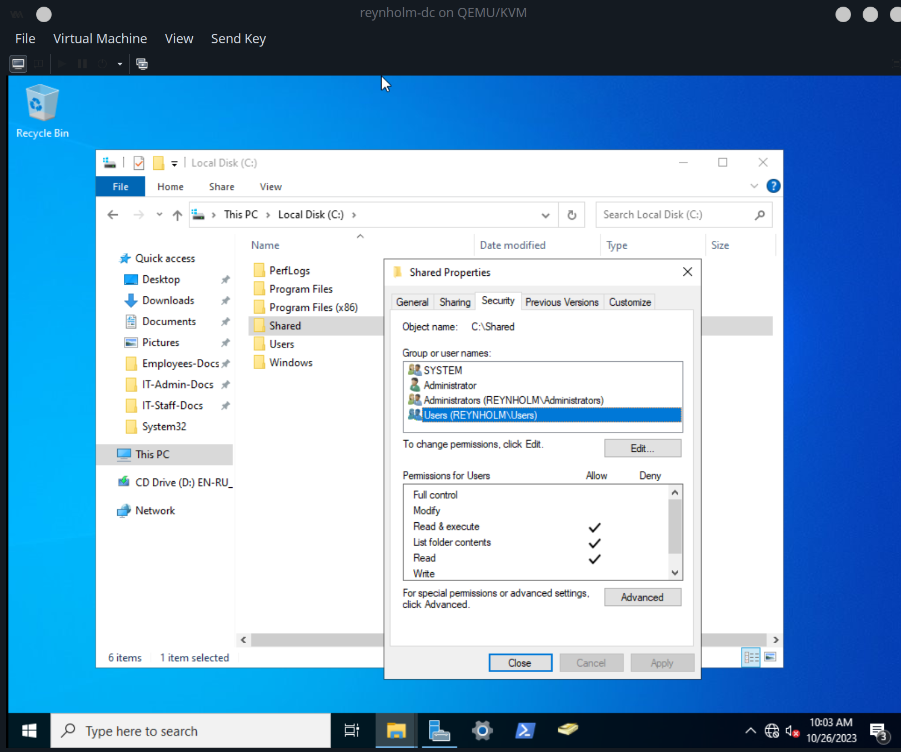
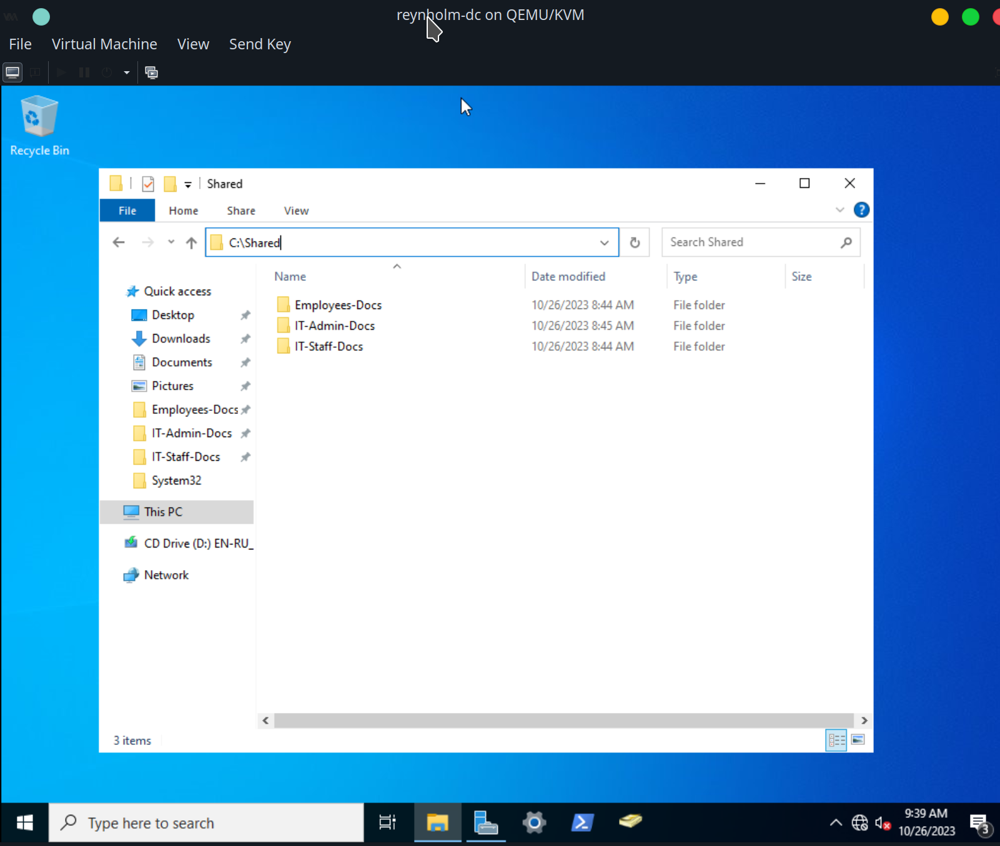
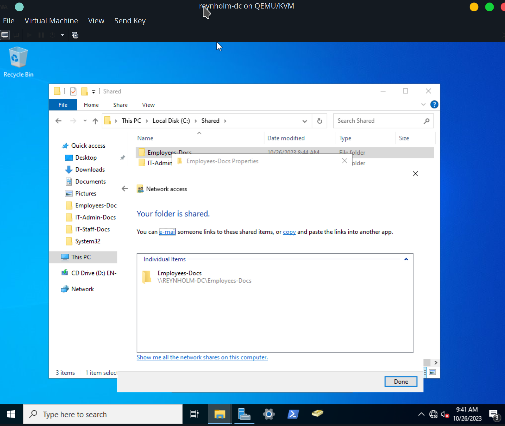
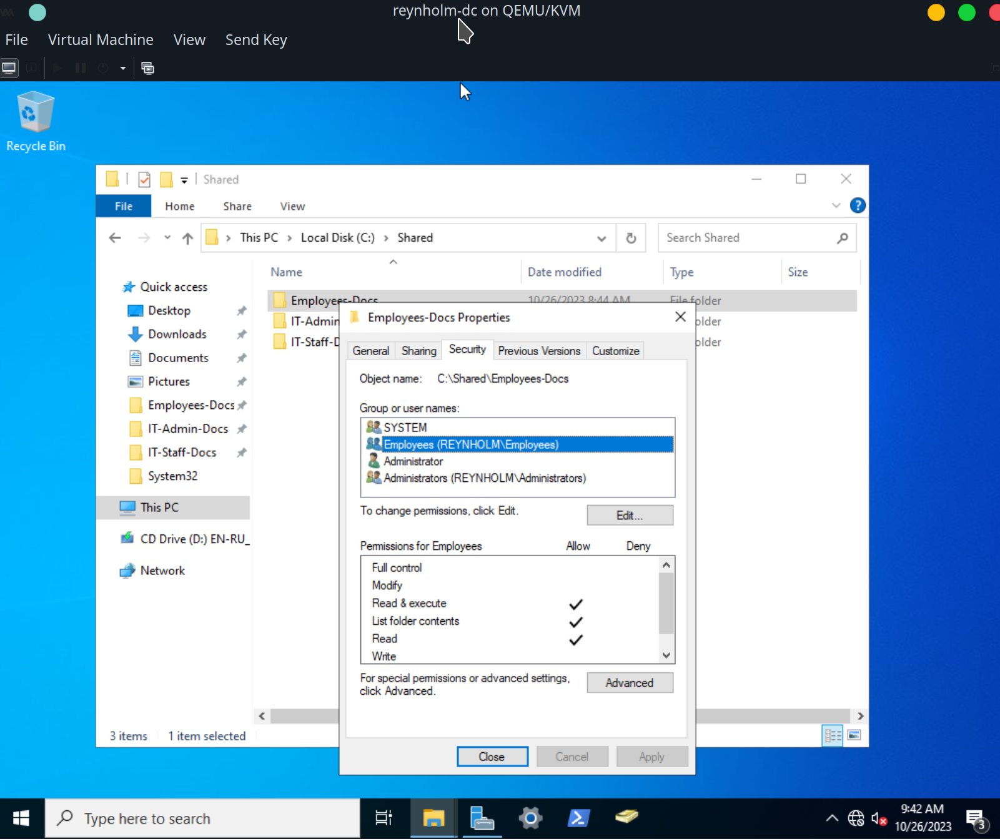
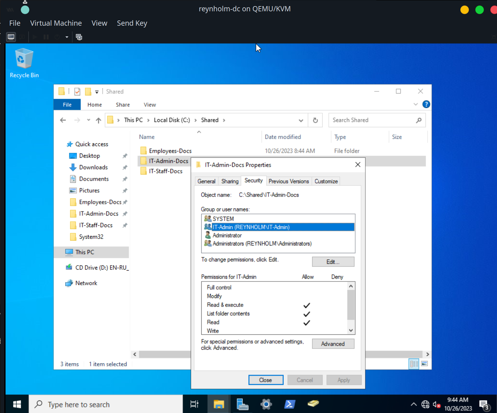
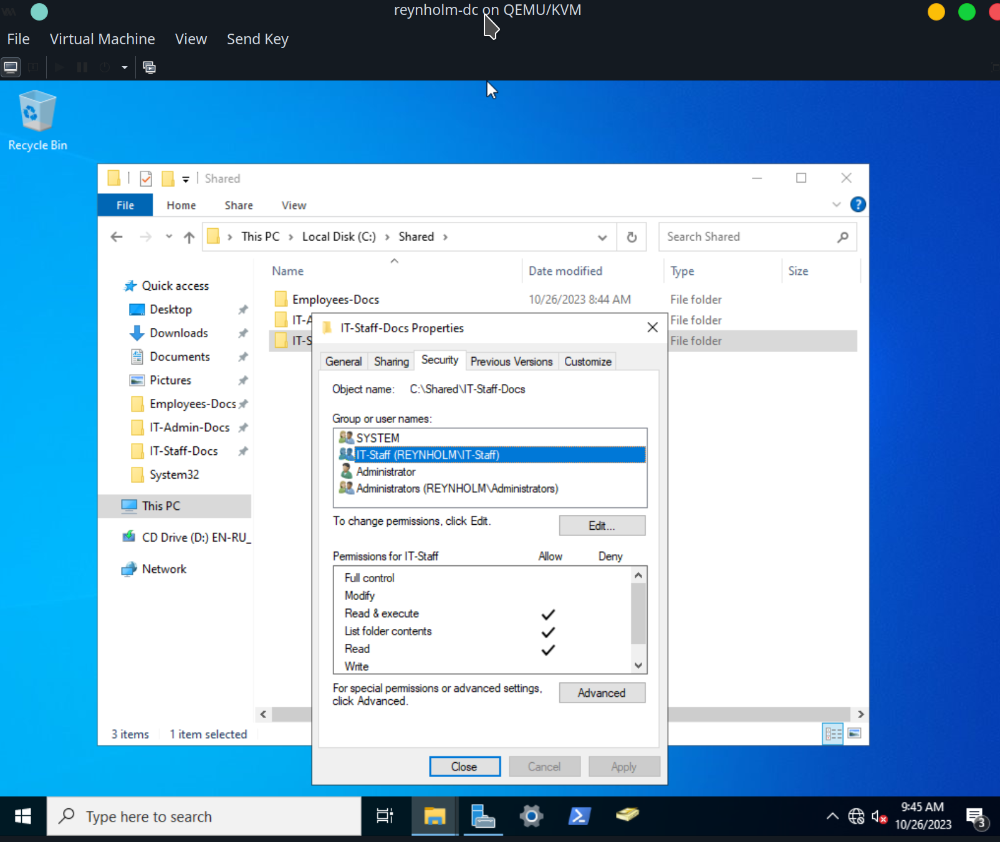

Network Path for `C:\Shared` is `\\REYNHOLM-DC\Shared`

Employees: nolan
As vmadmin, install cifs
```
sudo apt install cifs-utils -y
```

create mount dir for shared
```
sudo mkdir /mnt/domain-shared
```

mount shared directory
```
sudo mount -t cifs -o username=nolan,domain=REYNHOLM.local //REYNHOLM-DC/Shared /mnt/domain-shared/
```

The contents of `/mnt/domain-shared/` is `Employees-Docs`.

For user also in IT-Staff, contents are Employees-Docs and IT-Staff-Docs
For user also in IT-Admin, contents are Employees-Docs and IT-Staff-Docs
nd IT-Admin-Docs

NOTE:
Auto mount shared directory(?)
//ServerName/ShareName /path/to/mount cifs credentials=/path/to/credentials,file_mode=0755,dir_mode=0755 0 0

Create shared Users directory, allowing the domain group `Users` to read and write.
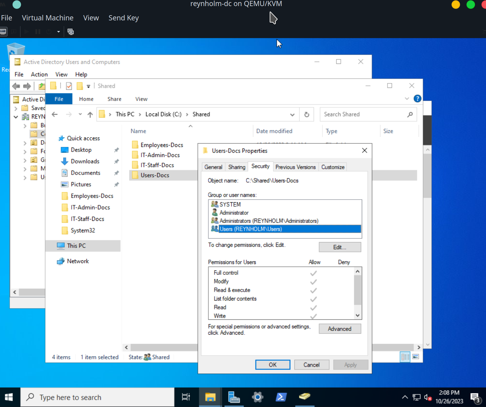


Richmond wrote a conky config to show info on his desktop:
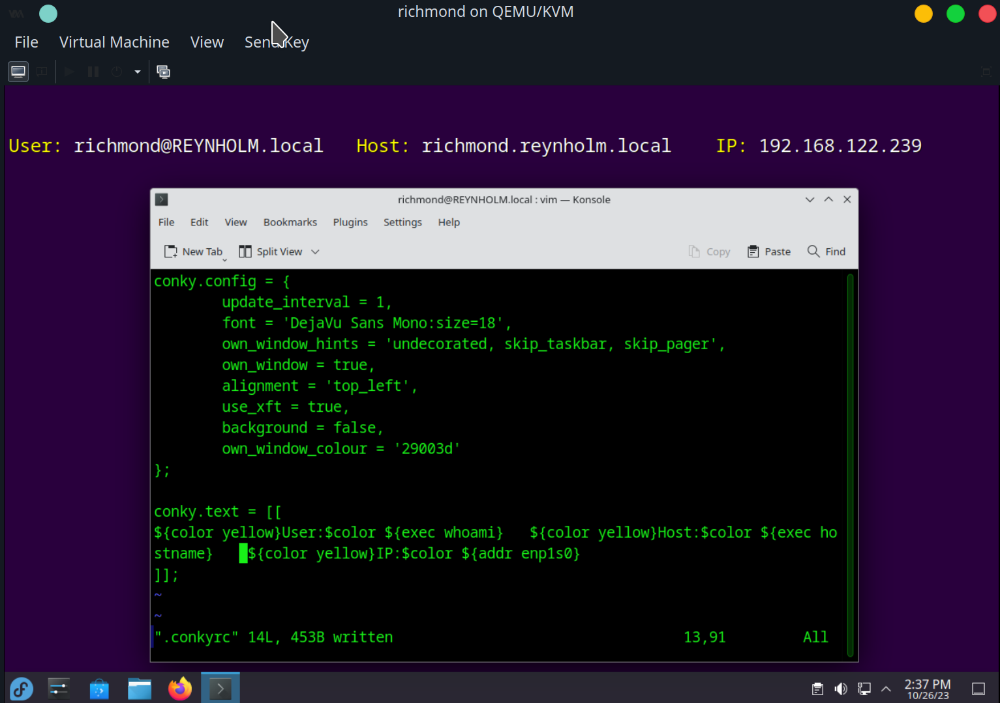

He mounts the shared directory:
sudo mount -t cifs -o username=moss,domain=REYNHOLM.local //REYNHOLM-DC/Shared /mnt/domain-shared/

He copies it to the /mnt/domain-shared/Users-Files directory:
sudo cp .conkyrc /mnt/domain-shared/Users-Docs/
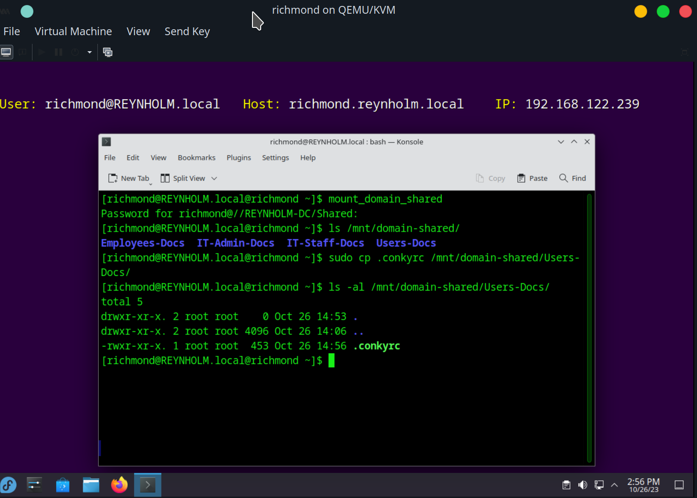

Next, moss can copy the conky config file from the Users-Docs directory:
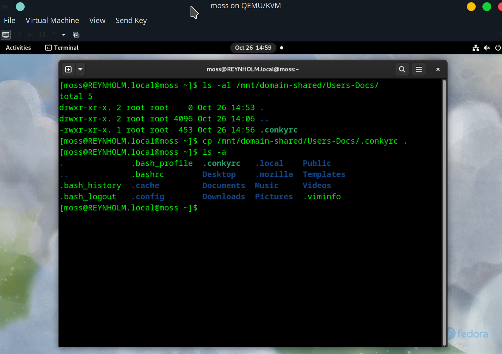

He's able to install conky and use that config file to display:
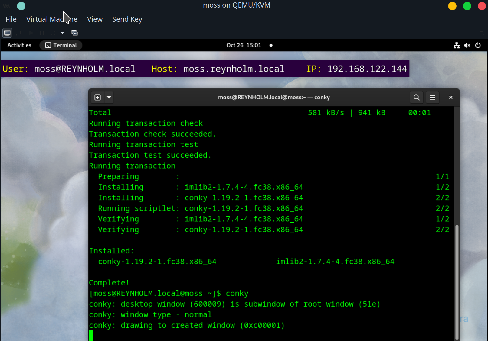

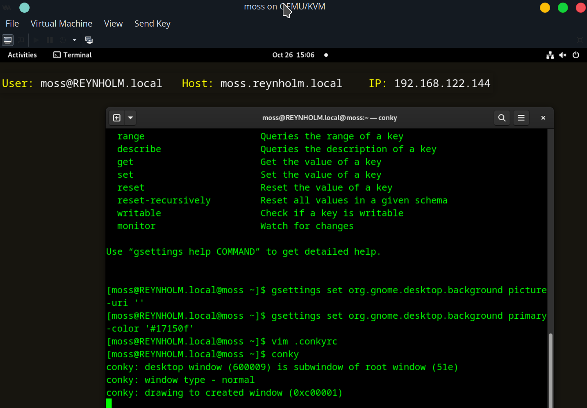

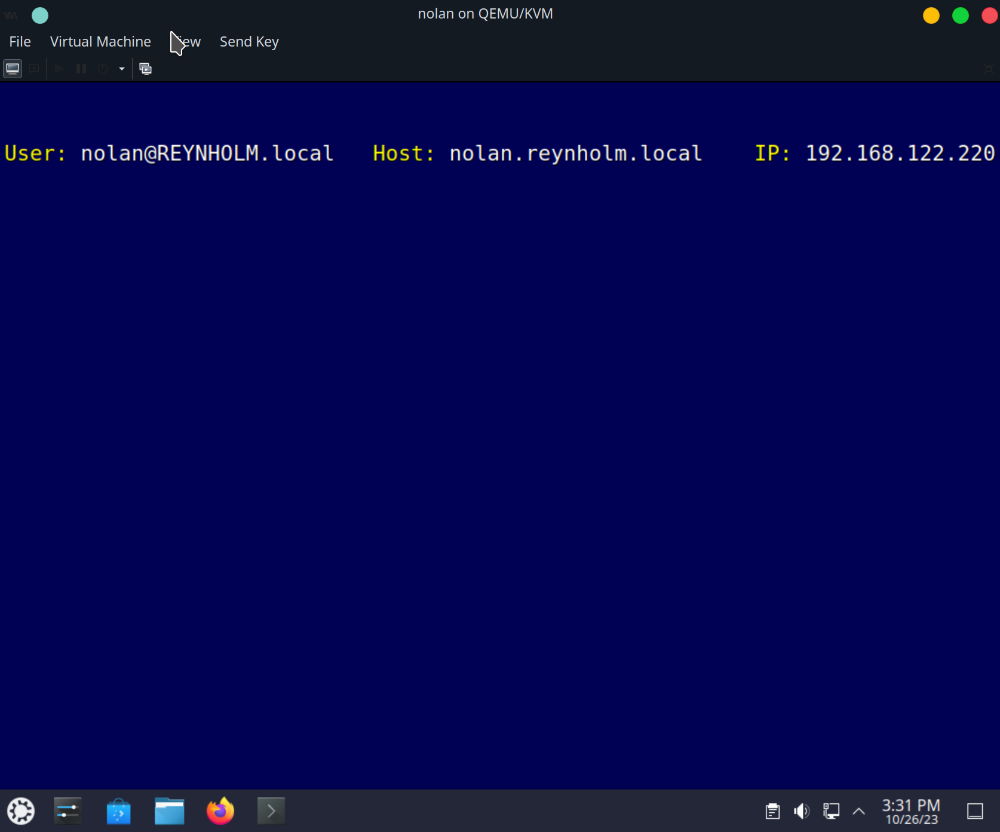