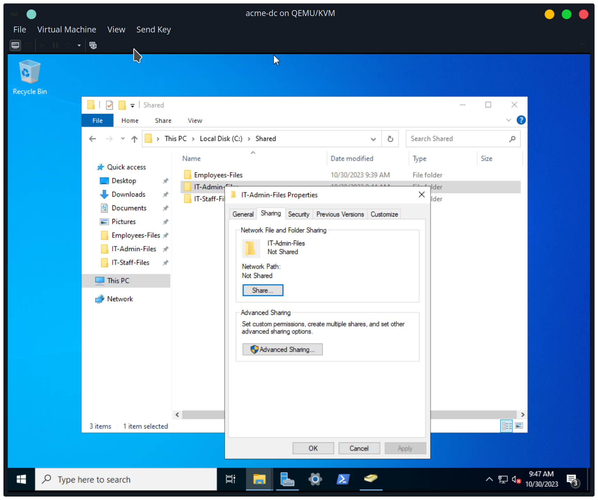
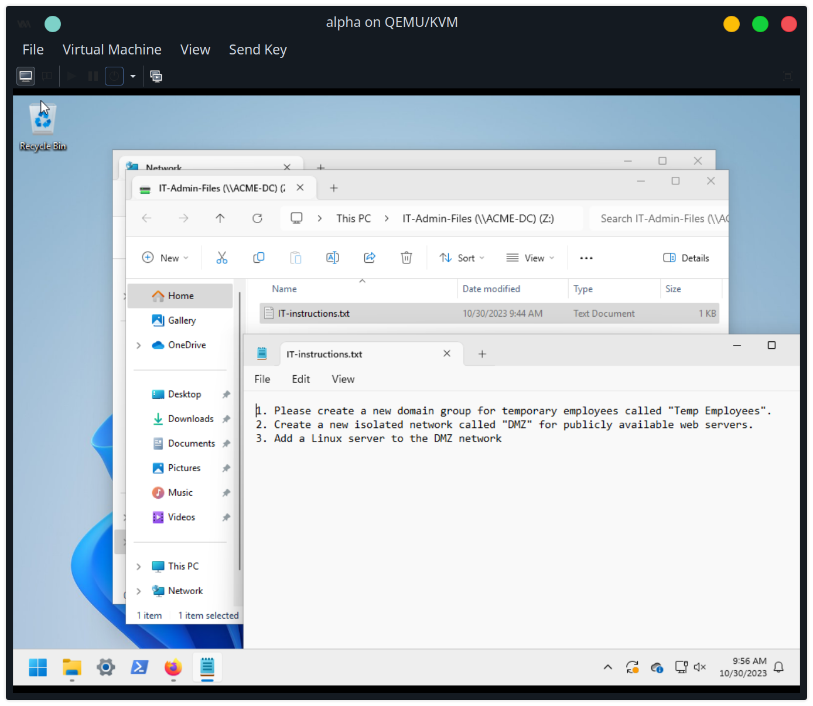

On acme-dc domain controller, I create three folders in the C:\Shared directory:
1. IT-Admin-Files
2. IT-Staff-Files
3. Employees-Files

Right-click the "IT-Admin-Files" folder and select "Properties", go to "Sharing", and click the "Share..." button.


Type "IT-Admin" and click the "Add" button. Then, click the "Share" button.


The folder is now shared with the "IT-Admin" domain group, at the path `\\ACME-DC\IT-Admin-Files`


Do the same for the "IT-Staff-Files" folder and the "IT-Staff" domain group, and the "Employees-Files" and the "Employees" group.





On the bravo VM, login as bob.
Install samba clients:
```
sudo dnf install samba-client cifs-utils
```


