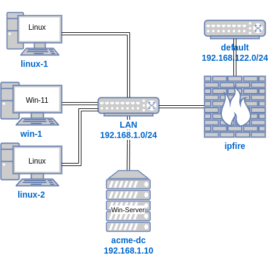
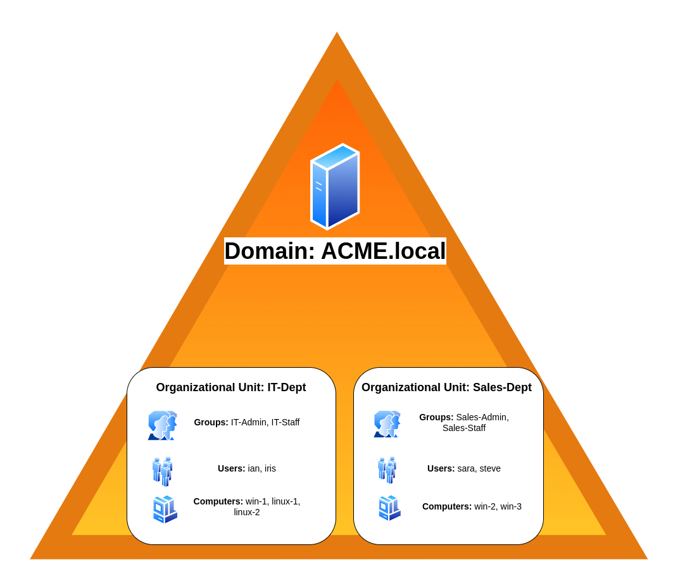

## Diagrams
Diagrams for the acme.local Active Directory domain

### Network

### Users and Groups

## Lab Steps
1. create ipfire firewall VM, connecting LAN + WAN
2. create linux-1 VM
3. create acme-dc VM as Active Directory domain controller for acme.local
4. create domain users
5. join linux-1 to acme.local domain
6. create windows-1 VM
7. join windows-1 to acme.local domain
8. create linux-2 VM
9.  join linux-2 VM to acme.local domain
10. test logging in different users in different machines
11. summary