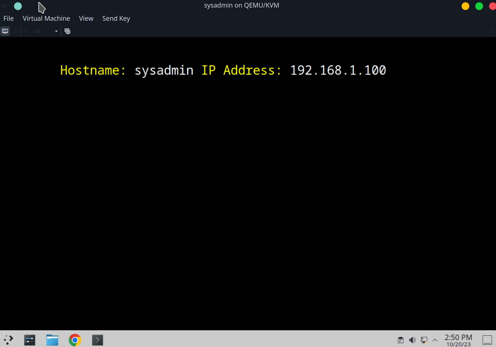

## Connect sysadmin NIC to LAN
When I open the `sysadmin` VM in the `virt-manager` QEMU program, go to the virtual hardware details, and click the its NIC device, there's a drop down menu for its network source. It's been connected to the `default` virtual network in NAT mode.

 When I click it, there's the `LAN` isolated network I just created. So, I select it. Now, the `sysadmin` VM's only network interface device is connected to the isolated `LAN` network:

## Change sysadmin NetworkManager settings
After changing the `sysadmin`'s NIC to the `LAN` network, it got a new IP address from the `pfsense` DHCP service.

## pfSense webConfigurator
I open a browser and enter the IP address for the `pfsense` interface connected to the `LAN` network: `https://192.168.1.1`. First, it gives me a warning message because the certificate pfSense uses for this HTTPS server isn't valid. I just click "Advanced" and click "Proceed to 192.168.1.1 (unsafe)".

I login with the default admin/pfsense username password. I will need to change that password.

## TODO: describe SSH from sysadmin to pfsense for management

## Connect to Internet
After I restart the `pfsense` VM, I'm able to access the internet from the `sysadmin` VM. 

