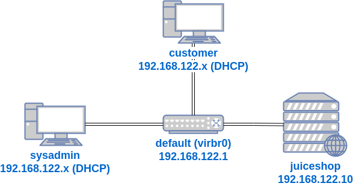

In a previous lab I create three VMs: `juicero`, `sysadmin`, and `customer`. The `juicero` VM is a Linux server running the vulnerable web application by OWASP called [Juice Shop](https://owasp.org/www-project-juice-shop/).

The `sysadmin` is a Linux workstation that manages the `juicero` server via SSH.

And the `customer` is a Linux workstation used by a customer of Juice Shop, using the Juice Shop web application running on the `juicero` VM.

The VMs all had virtual network interface cards (NICs) connected to the `default` virtual network. Here's a diagram of that setup at the beginning of this lab:

In this lab, I'll start by adding a new VM called `hacker`. It will have the operating system [Kali Linux](https://www.kali.org/) installed. It's a Linux distribution that has a lot of popular [penetration testing](https://en.wikipedia.org/wiki/Penetration_test) tools installed. I'll use it in this and future labs to demonstrate how vulnerabilities in the `juicero` server and `juice-shop` web application can be exploited.

I'll use `hacker` to run a SSH login cracking tool to get a Linux user account's password on `juicero`, and use several security practices to prevent that from happening again.

In the first step, I'll create the `hacker` VM.