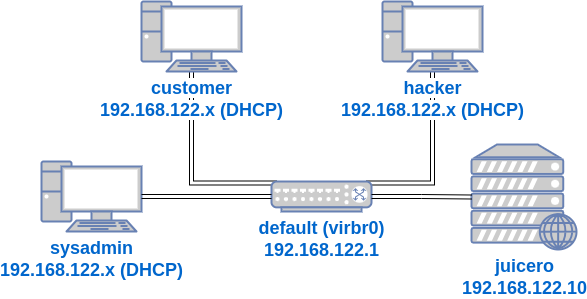

In a previous lab I create three VMs: `juiceshop`, `sysadmin`, and `customer`. The `juiceshop` VM is a Linux server running the vulnerable web application by OWASP called [Juice Shop](https://owasp.org/www-project-juice-shop/).

The `sysadmin` is a Linux workstation that manages the `juiceshop` server via SSH.

And the `customer` is a Linux workstation used by a customer of Juice Shop, using the Juice Shop web application running on the `juiceshop` VM.

The VMs all had virtual network interface cards (NICs) connected to the `default` virtual network. Here's a diagram of all the VMs connected to that same `default` network:

In the previous lab, I mentioned the security concept of "defense in depth". Using multiple multiple layers of solutions to a vulnerability, so that if an attacker has to get past more than one obstacle to exploit a vulnerability or "attack surface".

There was the vulnerability in `juiceshop` of allowing `sysadmin` and `juiceshop` to communicate via SSH. The `hacker` VM also had access to the same network, so they could use login cracking tools to get a weak Linux user password. Two layers of security for this was to require strong passwords (both initial and user defined), and to ban IP addresses that have multiple failed SSH login attempts.

The third layer of security was ["network segmentation"](https://www.comptia.org/blog/security-awareness-training-network-segmentation). This is when a network is divided into different "zones" by network devices. In this lab, I'll create an isolated network for the `sysadmin` and `juiceshop` to connect to. 

I'll add a new VM running the firewall server [pfSense](https://www.pfsense.org/), that will act as a gateway between the `customer` and `hacker` on the `default` network and the web server `juiceshop`.

I'll also show why adding another network segment for publicly accessible servers like `juiceshop` can add an additional layer of defense against malicious users like `hacker`.