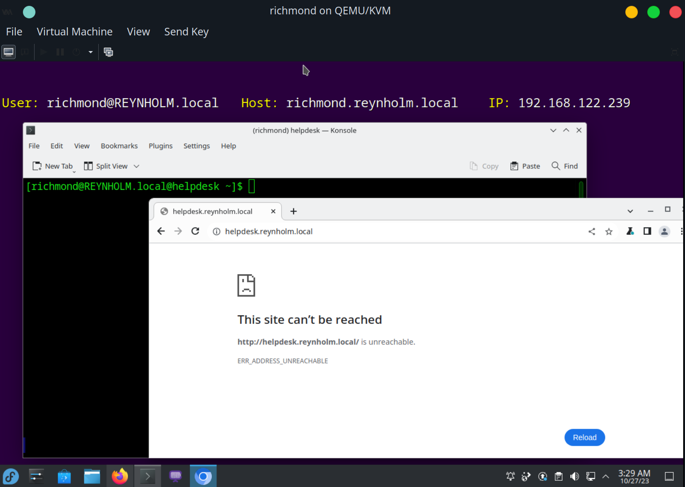
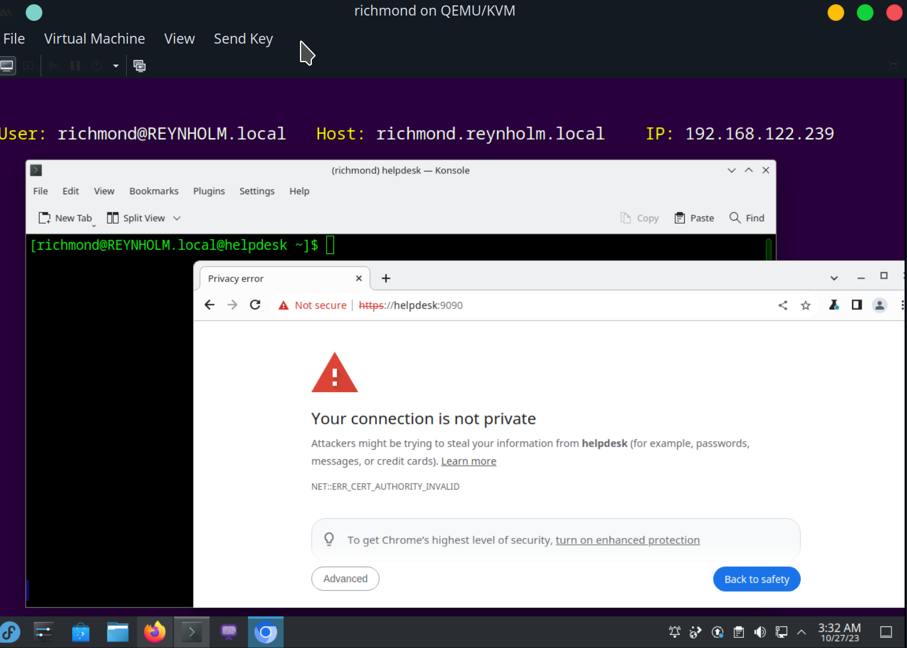
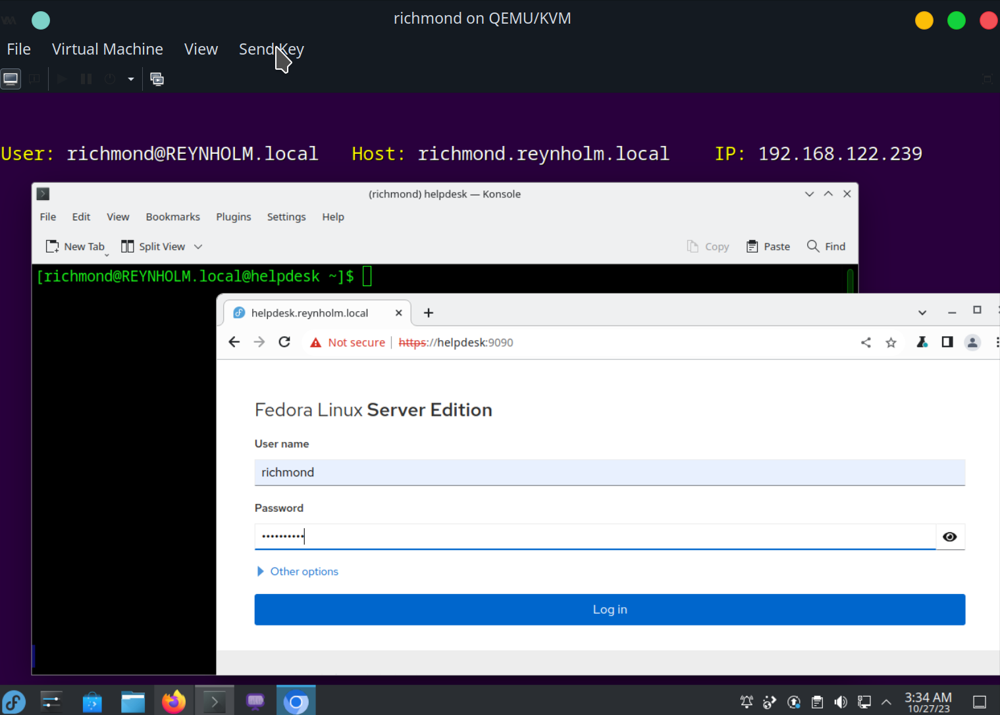
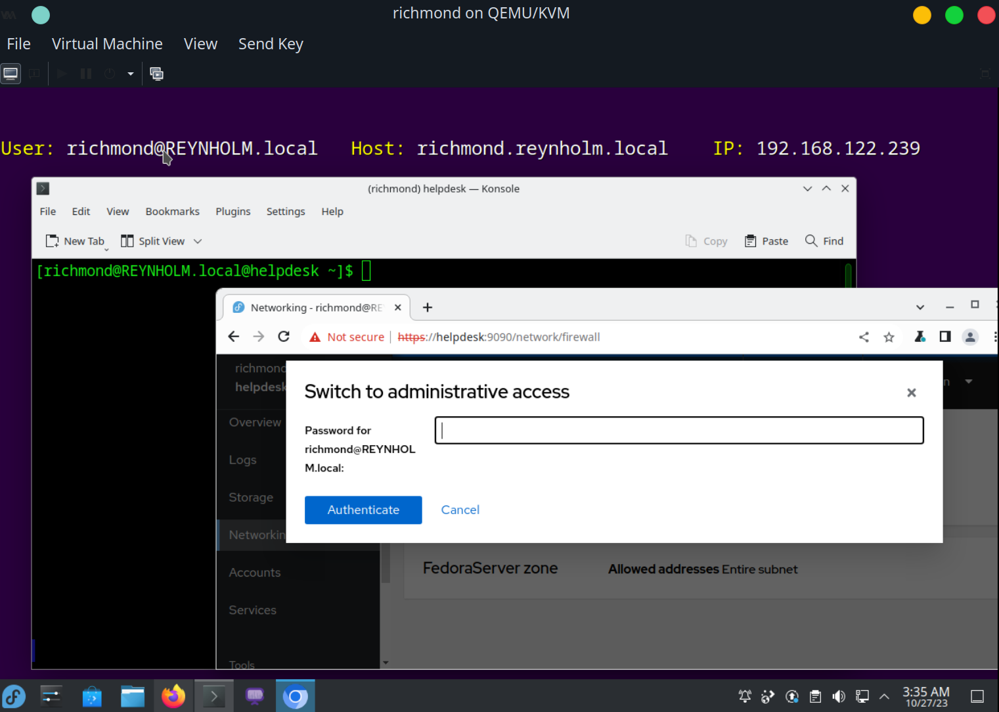
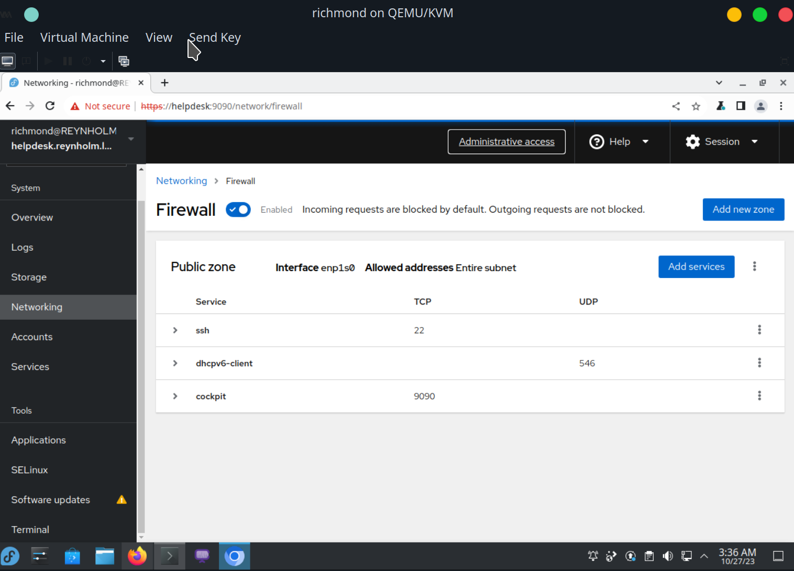
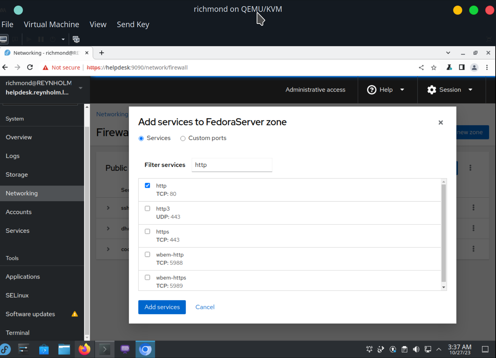
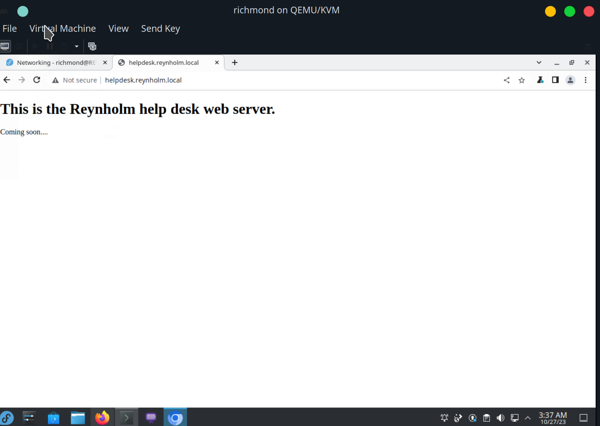
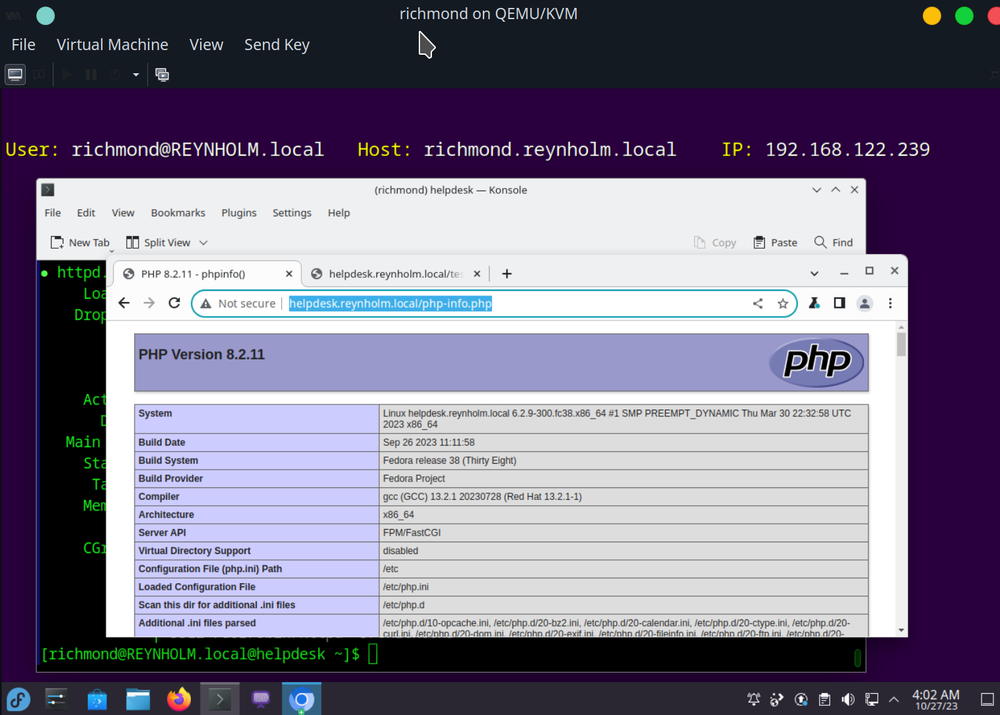
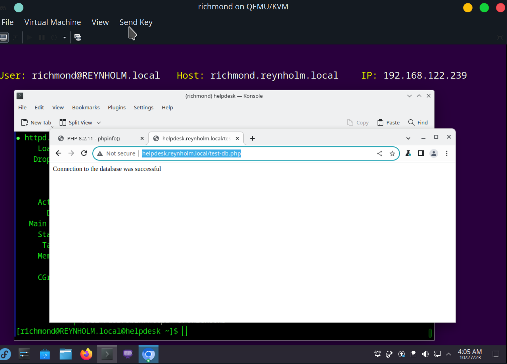
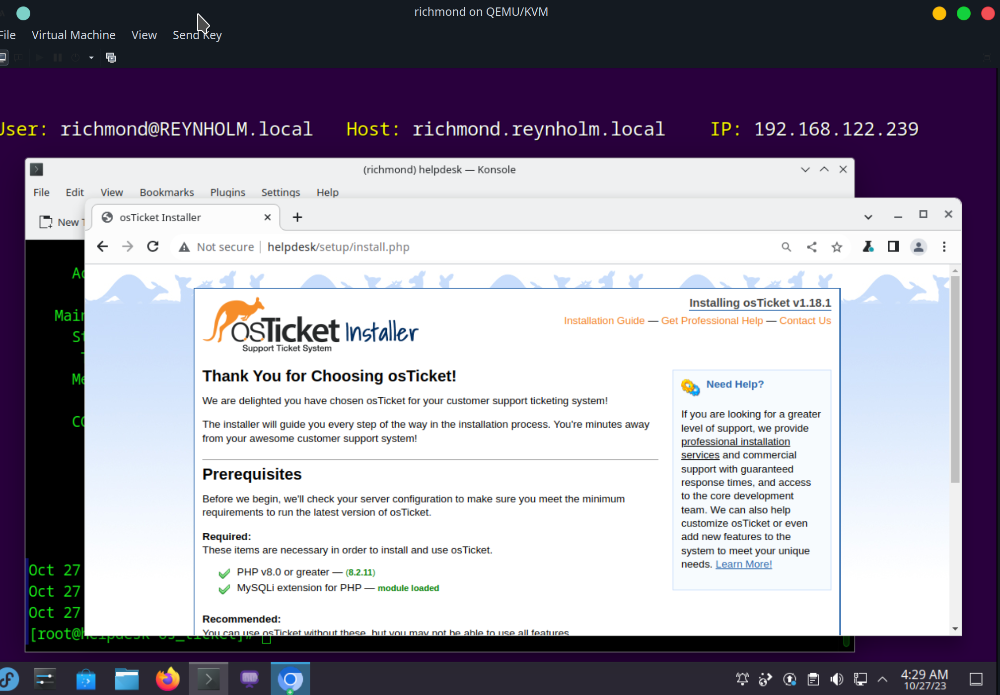

Install osTicket on `helpdesk` server by logging into the `richmond` VM as the domain user richmond@REYNHOLM.local, and using SSH to log into the `helpdesk` server.

## Install osTicket Prerequisites


### Install LAMP stack

#### Install Apache web server
Install and run Apache HTTP server:
```
sudo dnf -y install httpd
sudo systemctl start httpd
```

Add an `index.html` test page in the `/var/www/html` directory for Apache web server to serve as the web server main index.

```
sudo vim /var/www/html/index.html
```

Add a small placeholder `index.html`:
```html
<!DOCTYPE html>
<html>
    <body>
        <h1>This is the Reynholm help desk web server.</h1>
        <p>Coming soon....</p>
    </body>
</html>
```



So, check the Fedora Server admin console gui at `https://helpdesk:9090`


Bypassing the https warning to proceed, and logging in with the Active Directory domain user `richmond`:


Going to `https://helpdesk:9090/network/firewall`, I switch to administrative access:


I need to add http as a public zone service:


I filter the services by `http`, and click the add button:


Now, the Apache web server test page is served:


#### Install MariaDB
Install the MariaDB package:
```
sudo dnf install -y mariadb-server
```

Enable and Start the mariadb service:
```
sudo systemctl enable --now mariadb
```

Use mysql/mariadb security recommendations:
```
sudo mysql_secure_installation
```

#### Install PHP
Install the PHP package:
```
sudo dnf install -y php
```

Install the PHP extensions required by osTicket:
```
sudo dnf install -y php-{cli,fpm,common,mbstring,curl,gd,mysqlnd,json,xml,intl,pecl-apcu,opcache}
```

Restart the Apache web server:
```
sudo systemctl restart httpd
```

Create test php info page at `/var/www/html/php-info.php`:
```php
<?php phpinfo(); ?>
```

Check the page at `http://helpdesk.reynholm.local/php-info.php`:


It looks like PHP is working.

Create another test PHP page that connects to the `sample_db` database using the test user and password, at `/var/www/html/test-db.php`:
```php
 <?php
     $con = new mysqli('localhost', 'test_user', 'EXAMPLE_PASSWORD', 'sample_db');
 
     if ($con->connect_error) {
         die("Failed to connect to the database: " . $con->connect_error);
     }
     echo "Connection to the database was successful";
 ?>
```

Check the page at `http://helpdesk.reynholm.local/test-db.php`:


It looks okay. So now the LAMP stack seems to be installed. Next, install the mariadb database osTicket will use.


### Create MariaDB Database For osTicket
Log into MariaDB:
```
sudo mysql -u root -p
```

Create the database used by osTicket:
```sql
CREATE DATABASE os_ticket;
GRANT ALL PRIVILEGES on os_ticket.* TO 'os_ticket_user'@'localhost' identified by 'EXAMPLE_PASSWORD';
EXIT;
```
Where `EXAMPLE_PASSWORD` is a new password for the new `os_ticket_user` database user.


## Install osTicket
Now that the prerequisites are done, download and install the osTicket web application.

### Download osTicket code
Create the directory to install osTicket:
```
sudo mkdir -p /var/www/os_ticket
```

Change to root user:
```
sudo -i
```

Go to the osTicket directory and download the latest version of osTicket from its GitHub repository (currently v1.18.1):
```
cd /var/www/os_ticket
wget https://github.com/osTicket/osTicket/releases/download/v1.18.1/osTicket-v1.18.1.zip
```

Unzip the downloaded zip file:
```
unzip osTicket-v1.18.1.zip
```

After unzipped, delete the zip file:
```
rm osTicket-v1.18.1.zip
```

Copy the sample config file as the config file:
```
cp upload/include/ost-sampleconfig.php upload/include/ost-config.php
```

### Create Virtual Host File
Create a file at `/etc/httpd/conf.d/os_ticket.conf`:
```
 <VirtualHost *:80>
   ServerAdmin webmaster@helpdesk
   DocumentRoot /var/www/os_ticket/upload
   ServerName helpdesk
   ErrorLog logs/helpdesk-error_log
   CustomLog logs/helpdesk-access_log common
 </VirtualHost>
```

Restart the Apache web server:
```
systemctl restart httpd
```

Go to the `http://helpdesk` web server, get redirected to `http://helpdesk/setup/install.php` to continue installation:


TODO: complete installation
Change file ownership for the `ost-config.php` copied earlier:
```
chmod 0666 upload/include/ost-config.php
```


