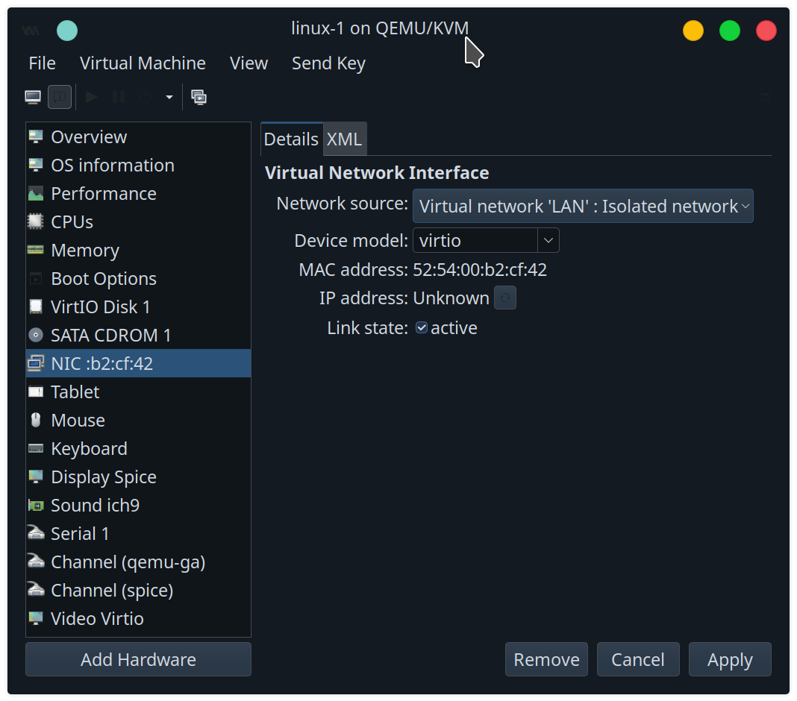
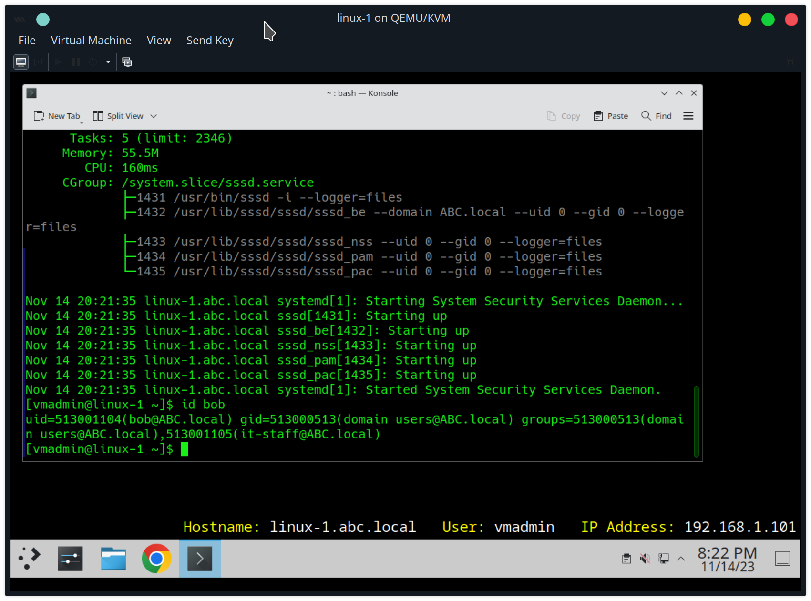
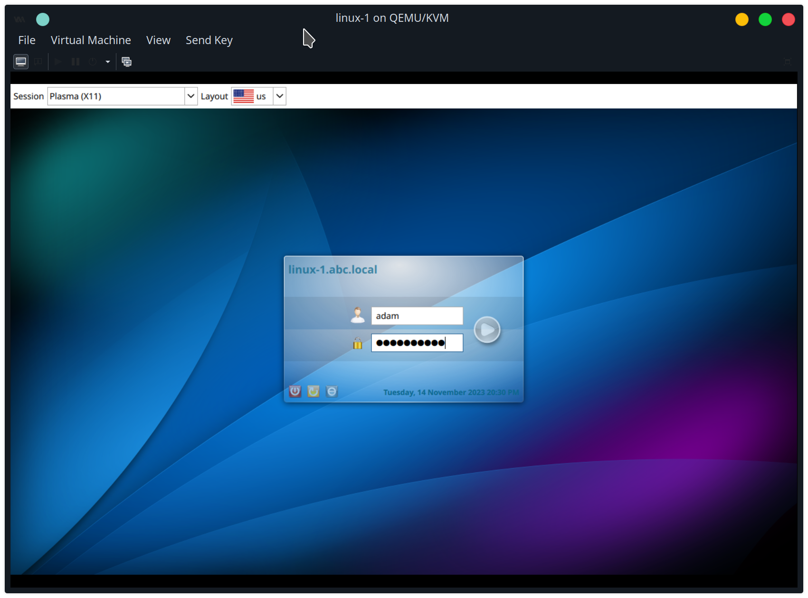

change hostname to linux-1.abc.local

use domain controller as DNS


test with nslookup abc-dc


install adcli, authselect, oddjob, and sssd packages


install packages for joining domain
```
yay -S sssd adcli oddjob authselect krb5
```

set authselect to sssd and mkhomedir
```
sudo authselect select sssd with-mkhomedir --force
```

enable/start oddjobd service
```
sudo systemctl enable --now oddjobd
```
Join the acme.local domain, using the domain controller server
```
sudo adcli join -D acme.local -S acme-dc.acme.local
```

## Start sssd Service
Create the /etc/sssd/sssd.conf file has the following configuration:
```
[sssd]
domains = ABC.local
default_domain_suffix = ABC.local
config_file_version = 2
services = nss, pam

[domain/ABC.local]
default_shell = /bin/bash
krb5_store_password_if_offline = True
cache_credentials = True
krb5_realm = ABC.LOCAL
realmd_tags = manages-system joined-with-adcli
id_provider = ad
fallback_homedir = /home/%u@%d
ad_domain = ABC.local
use_fully_qualified_names = True
ldap_id_mapping = True
access_provider = ad
```

Restrict access to sssd.conf to root
```
sudo chmod 600 /etc/sssd/sssd.conf
```

Enable/start the sssd service
```
sudo systemctl enable --now sssd
```

Check if a domain user can be id'd
```
id adam
```


create a sudo file /etc/sudoers.d/it_admin_sudo, giving the abc.local domain group IT-Admin (just user adam) to have full sudo privileges
```
 %it-admin@abc.local ALL=(ALL) ALL
```
Log out and login as adam



change desktop wallpaper


use browser to use pfsense webConfigurator


Next, add wazuh server to SOC network
