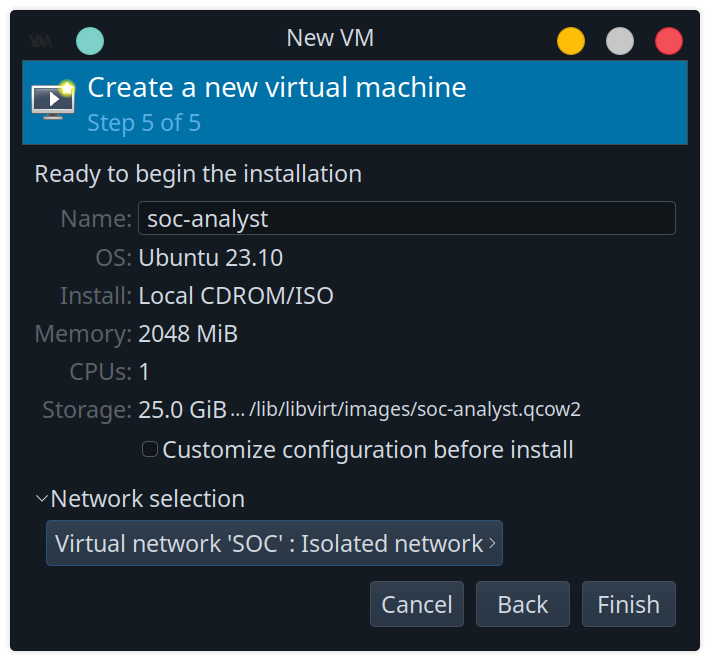
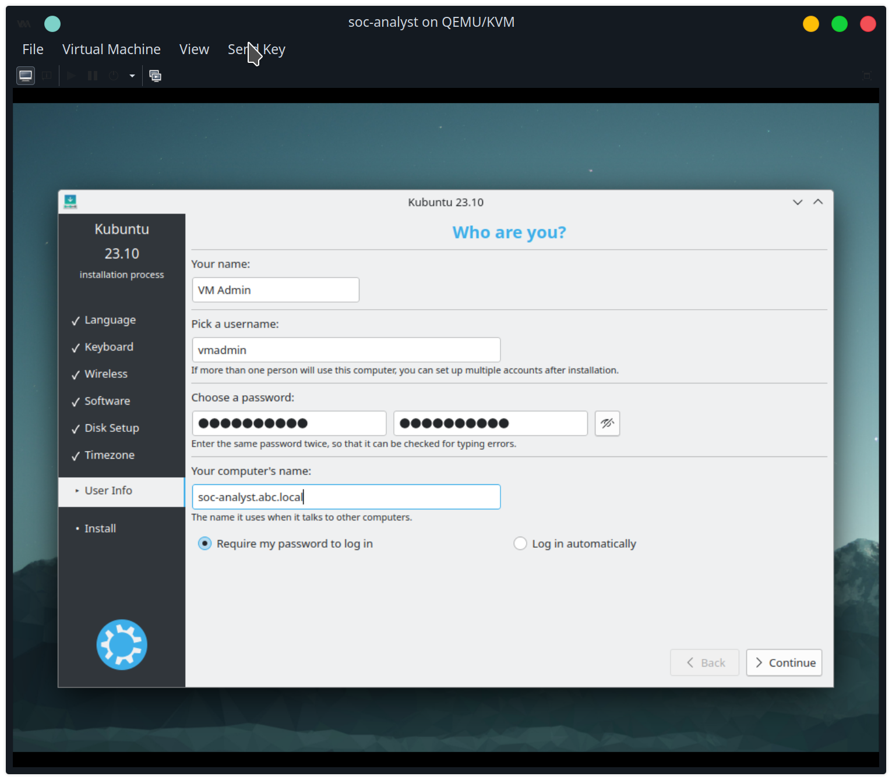
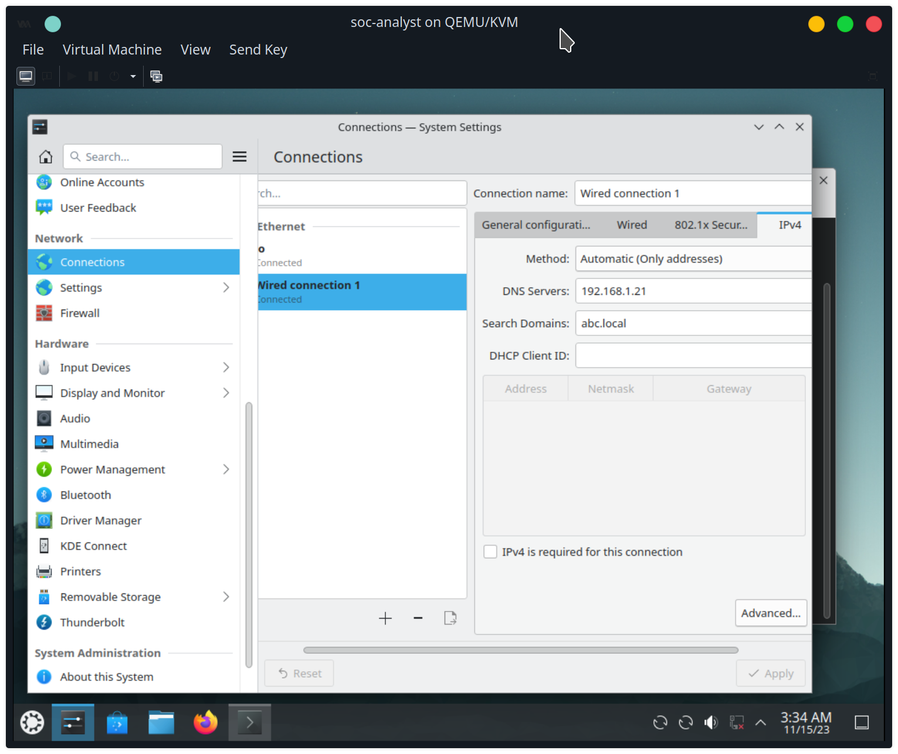
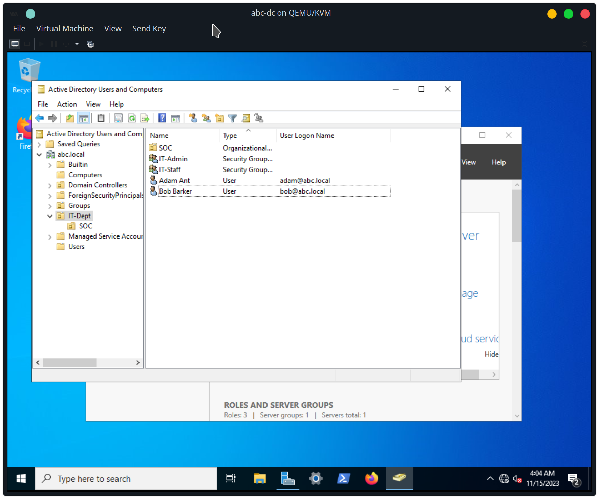
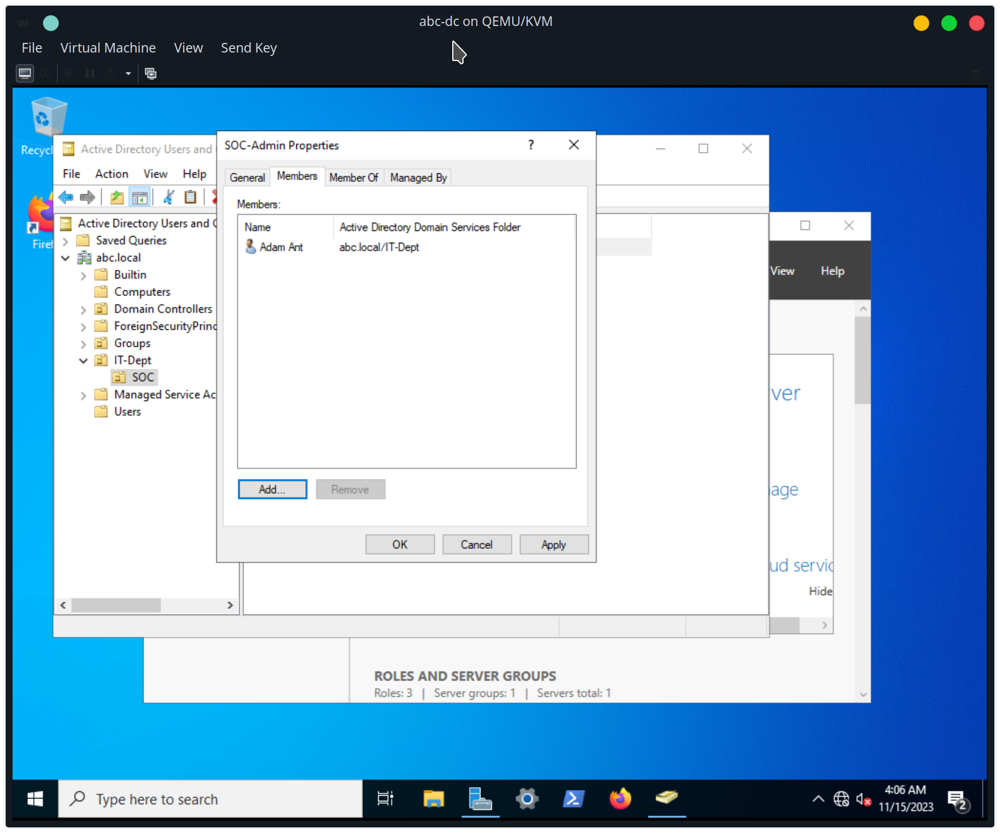
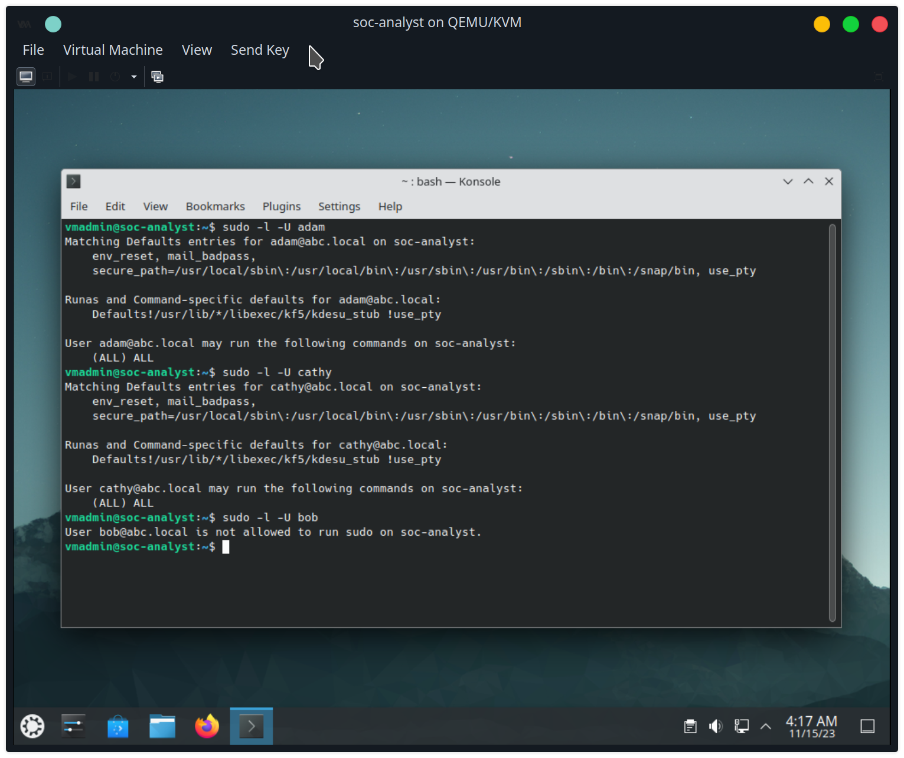

create soc-analyst VM


using https://ubuntu.com/server/docs/service-sssd-ad to join abc.local domain



stop and disable the systemd-resolved service

unlink /etc/resolv.conf

write /etc/resolv.conf
```
nameserver 192.168.1.21
search abc.local
```

install apt packages for joining Active Directory domain
```
sudo apt install sssd-ad sssd-tools realmd adcli
```

verify that domain can be discovered
```
sudo realm discover abc-dc.abc.local -v
```

join domain
```
sudo realm join abc-dc.abc.local -v
```

the realm program generates the /etc/sssd/sssd.conf file

I add the default domain suffix setting to the file
```
default_domain_suffix = abc.local
```

set the permission to 600
```
sudo chmod 600 /etc/sssd/sssd.conf
```

restart sssd service
```
sudo systemctl restart sssd
```

enable mkhomedir so that user login will create a folder in /home
```
sudo pam-auth-update --enable mkhomedir
```

on the domain controller, create a new organizational unit (OU) called SOC inside the IT-Dept OU.


In the SOC OU, create a new user called cathy, and new security groups called SOC-Staff and SOC-Admin


add adam and cathy to the SOC-Staff. 


and add adam to the SOC-Admin group.



On the soc-analyst VM, give full sudo privileges to the domain group SOC-Staff by creating the sudo file /etc/sudoers.d/soc_staff_sudo:
```
%soc-staff@abc.local ALL=(ALL) ALL
```

Checking the adam, bob, and cathy domain users sudo privilege using `sudo -l -U <user>` shows that adam and cathy are allowed to run sudo (both members of SOC-Staff), but not bob


