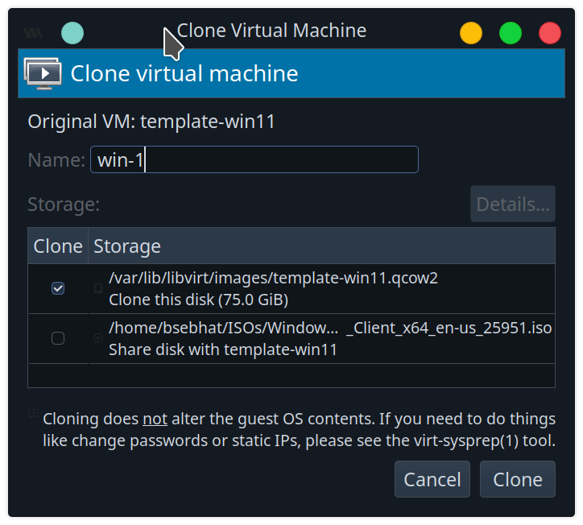
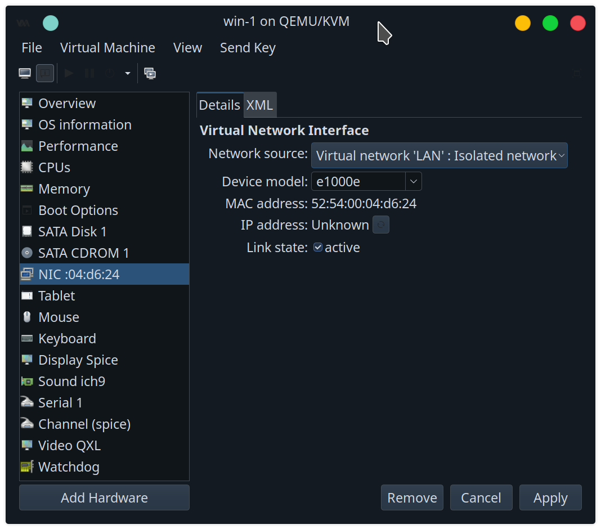
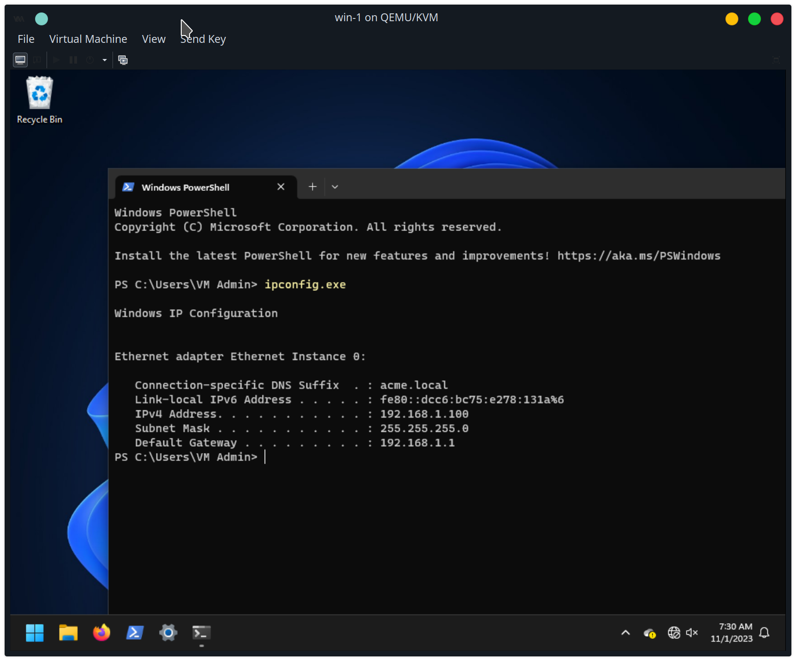
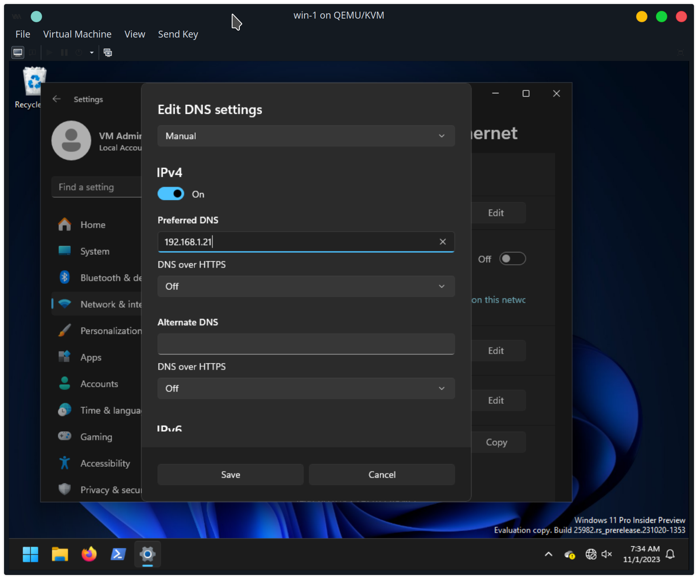
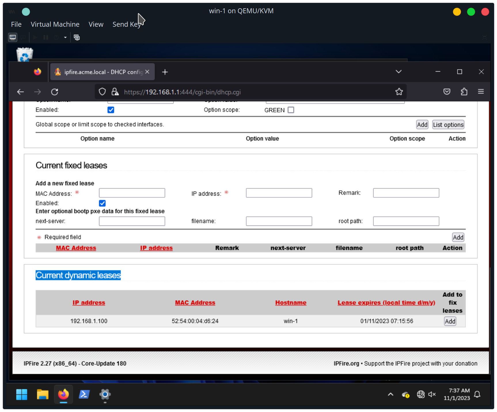
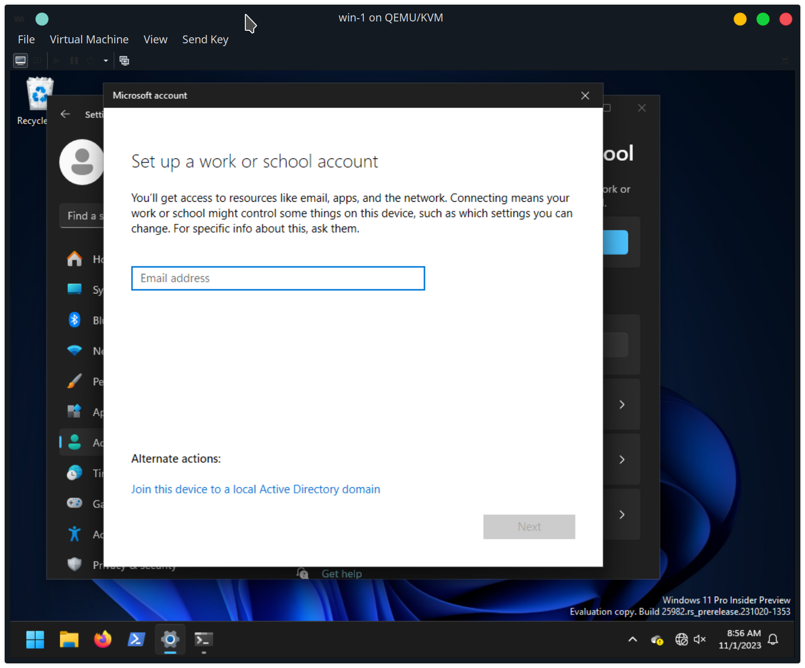
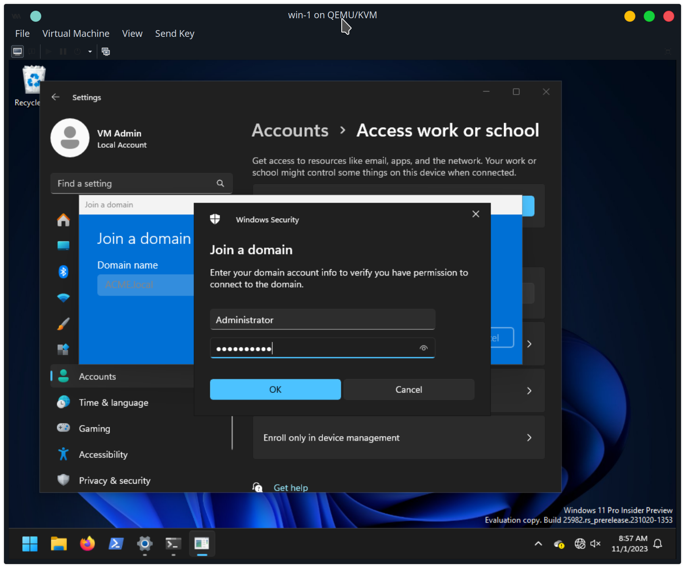
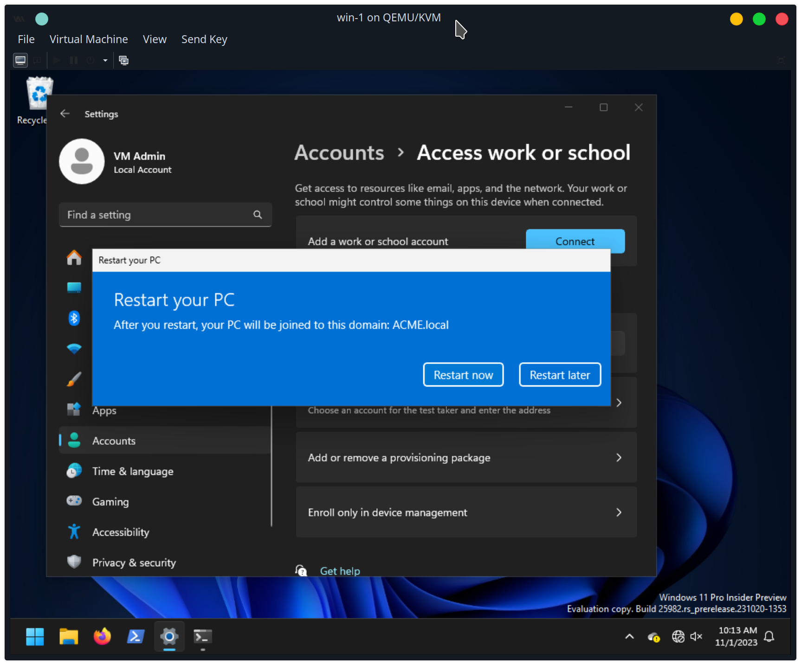
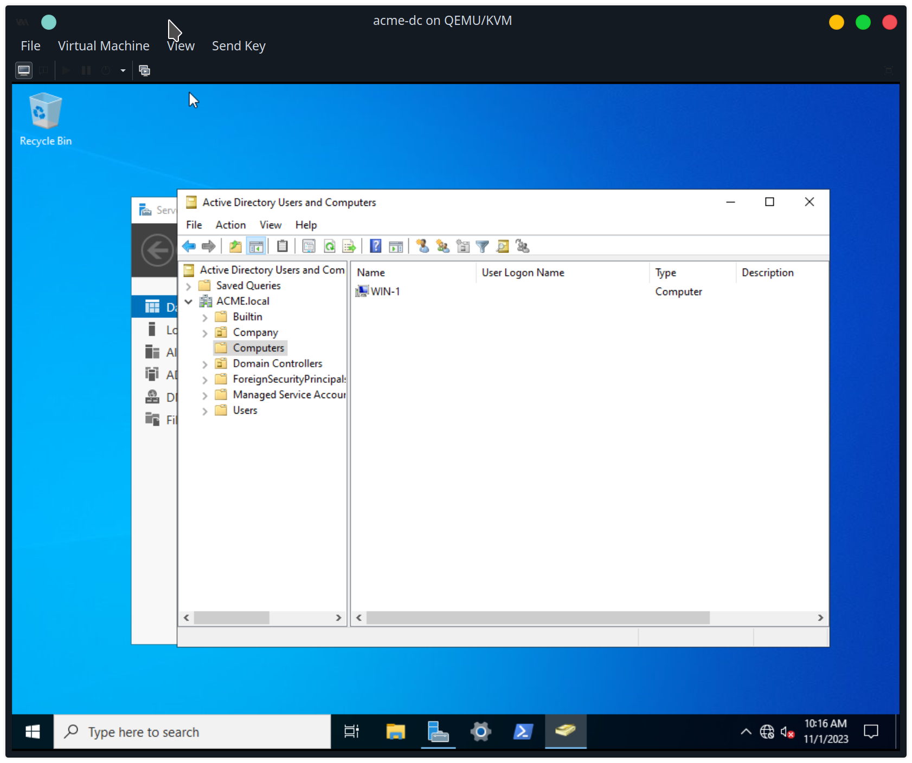
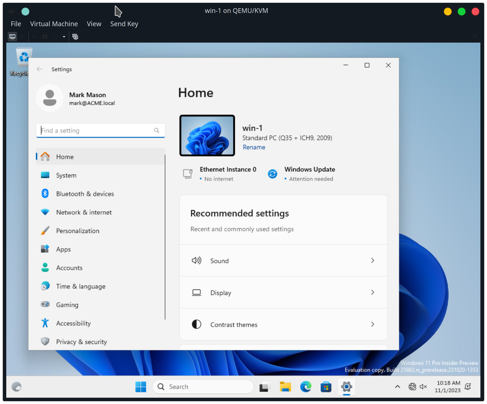

I clone a Windows 11 desktop from my `template-win11` VM, and call it `win-1`

I set its NIC to connect to the `LAN` network

Starting the machine, it's given the IP address `192.168.1.100`, and the domain suffix `acme.local`.

I haven't set the DNS to use the domain controller at `192.168.1.21`, or changed the computer/hostname.

Connecting to the `ipfire` web interface, it shows that the DHCP service has a record for the new VM.

join domain

restart

login as mark

In the `acme-dc` domain controller, the newly joined `win-1` computer appears in the `ACME.local/Computers` folder.

And the user is logged in as mark.

I move that `win-1` computer into the Office OU, because it will belong to the office workers.
