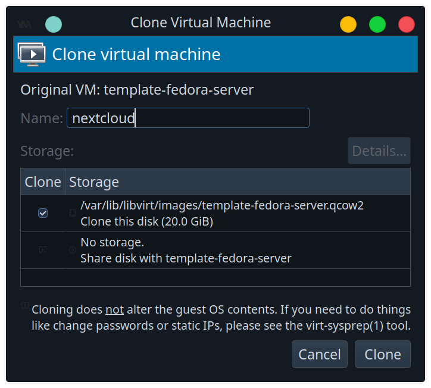
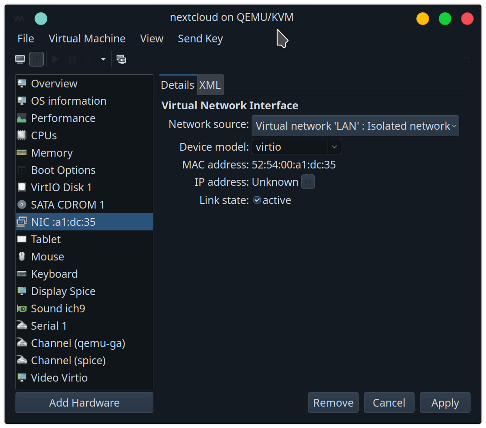

change hostname to nextcloud

set static IP 192.168.1.16, and gateway 192.168.1.1
```
sudo nmcli con modify 'enp1s0' ifname enp1s0 ipv4.method manual ipv4.addresses 192.168.1.16/24 gw4 192.168.1.1
sudo nmcli con up 'enp1s0'
```

Stop and disable systemd-resolved
```
sudo systemctl stop systemd-resolved
sudo systemctl disable systemd-resolved
```

unlink /etc/resolv.conf
```
sudo unlink /etc/resolv.conf
```

write /etc/resolv.conf with domain controller
```
nameserver 192.168.1.21
search acme.local
```

discover domain
```
sudo realm discover -v ACME.local
```
join domain
```
sudo realm join -v ACME.local
```
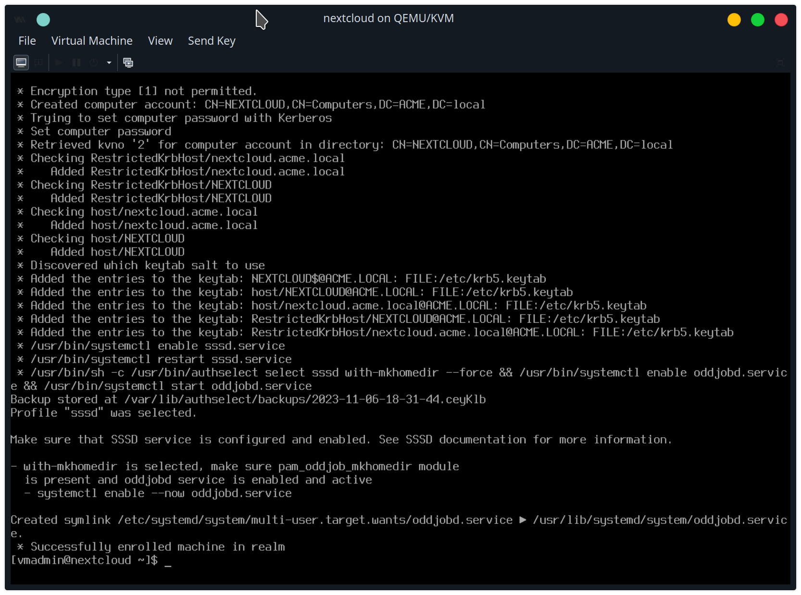

The nextcloud server appears in domain computers
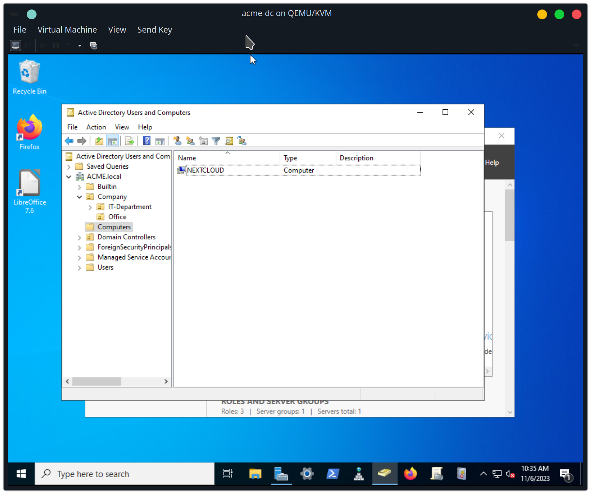
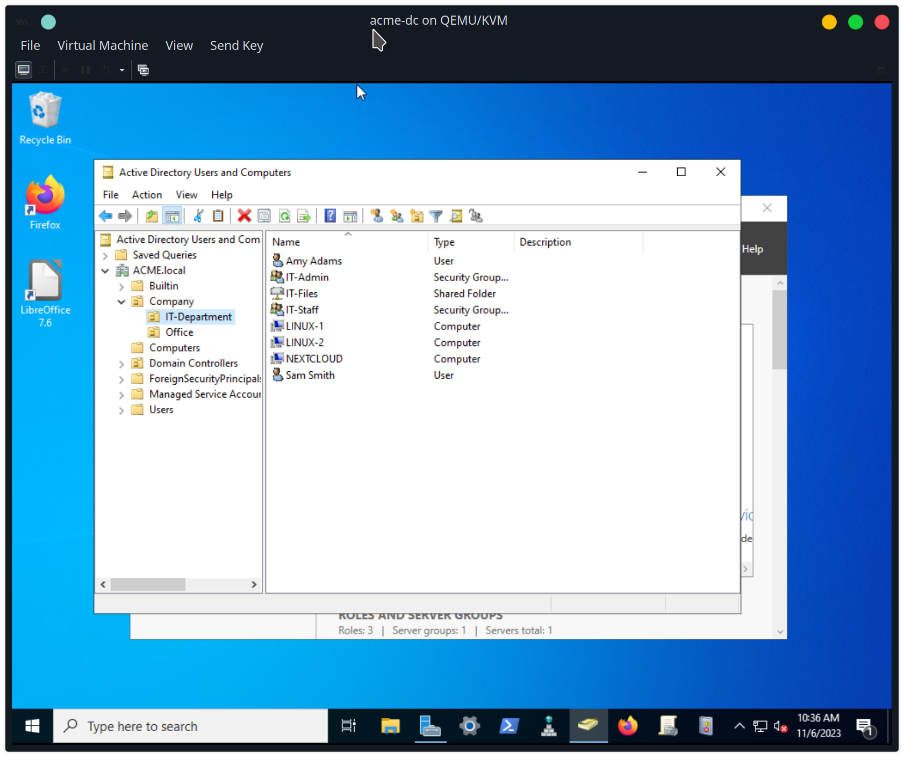

enable default domain suffix 'ACME.local'
edit /etc/sssd/sssd.conf, add line:
```
default_domain_suffix = 'ACME.local'
```

restart sssd service:
```
sudo systemctl restart sssd
```

test user id
```
id amy
```

from linux-1, go to nextcloud's fedora server at https://nextcloud.acme.local:9090
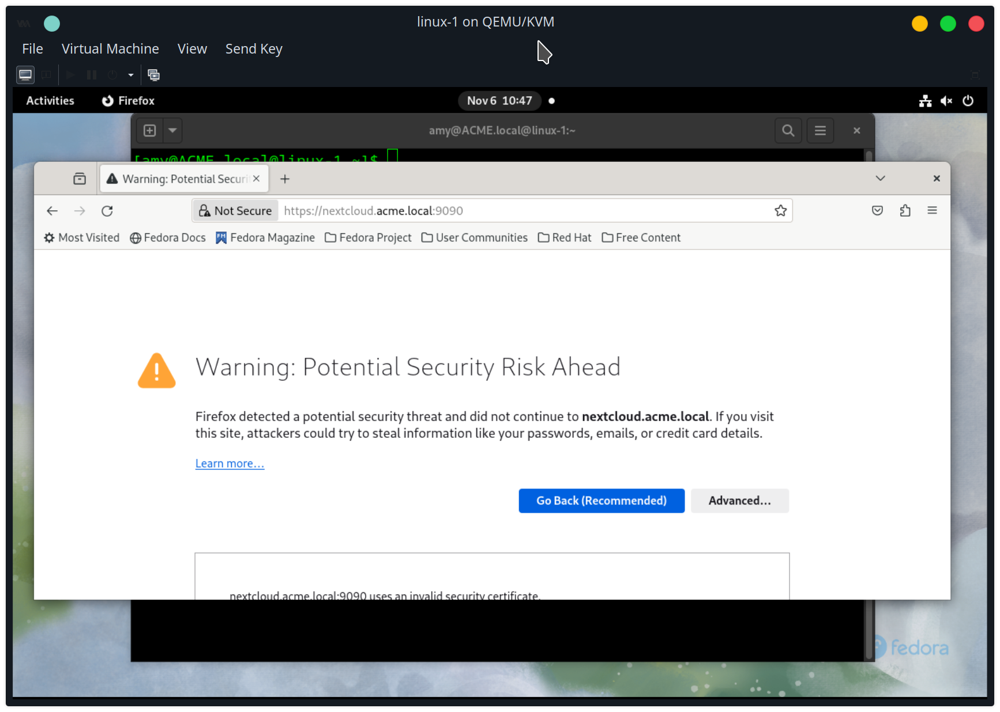

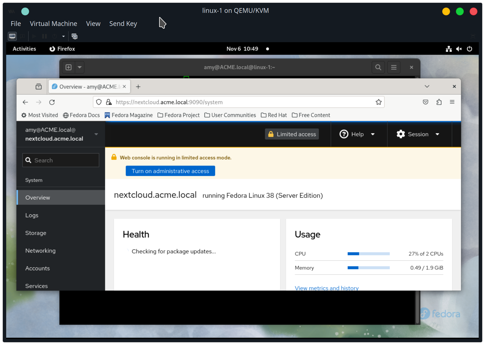
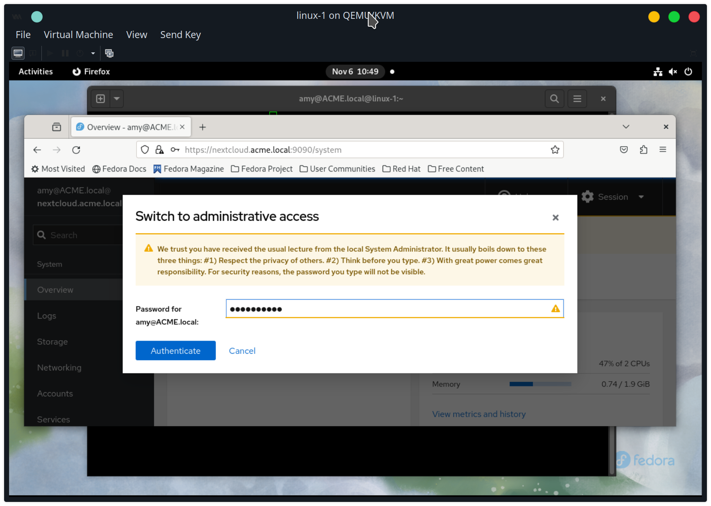

domain user amy doesn't have sudo access
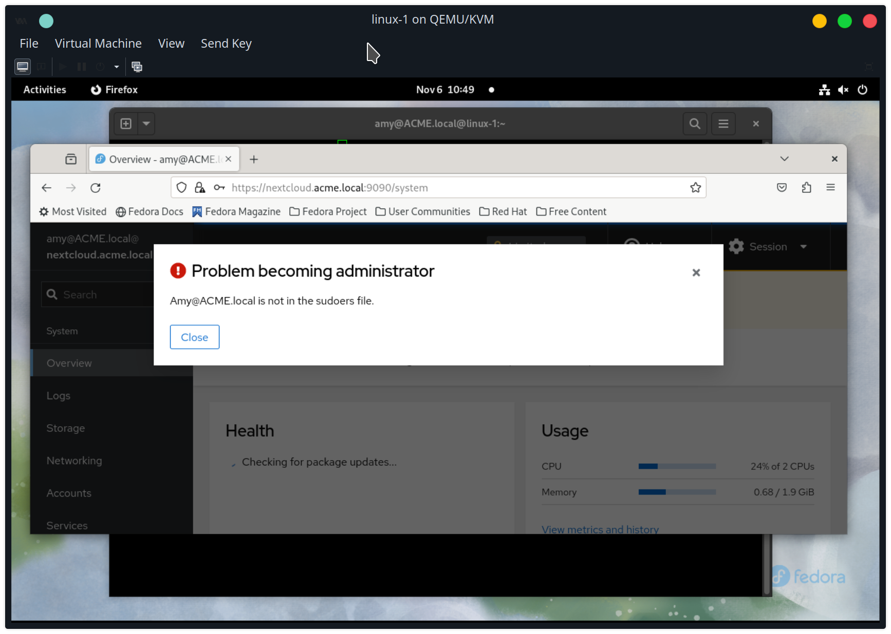

add acme.local domain security group it-admin sudo access on nextcloud server
as vmadmin sudo user, create it_admin_sudo file in /etc/sudoers.d/
```
%it-admin@acme.local ALL=(ALL) ALL
```

Now, amy can use administrative access
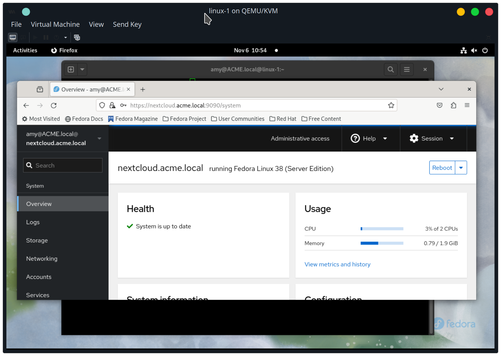

ssh into nextcloud server as amy
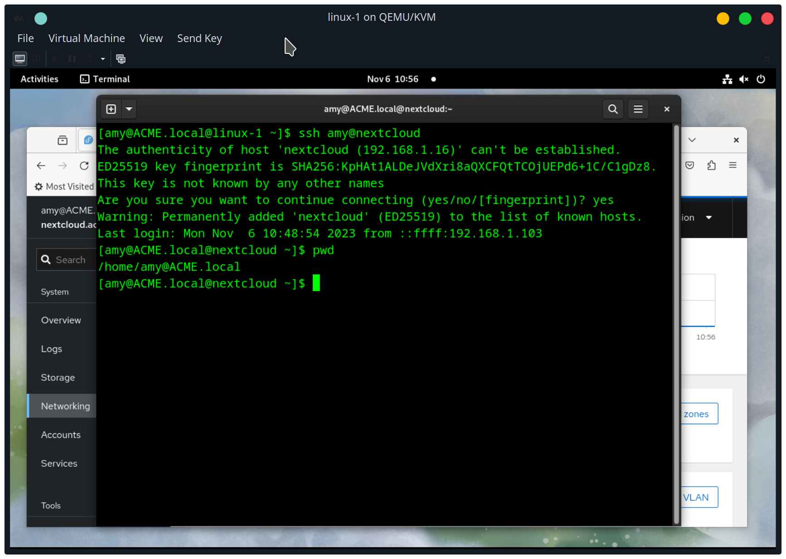

