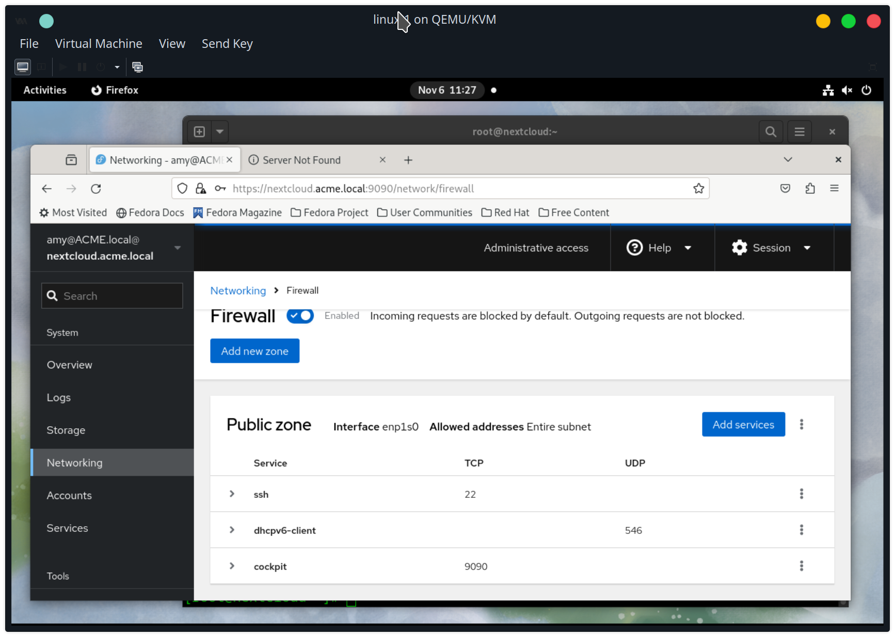
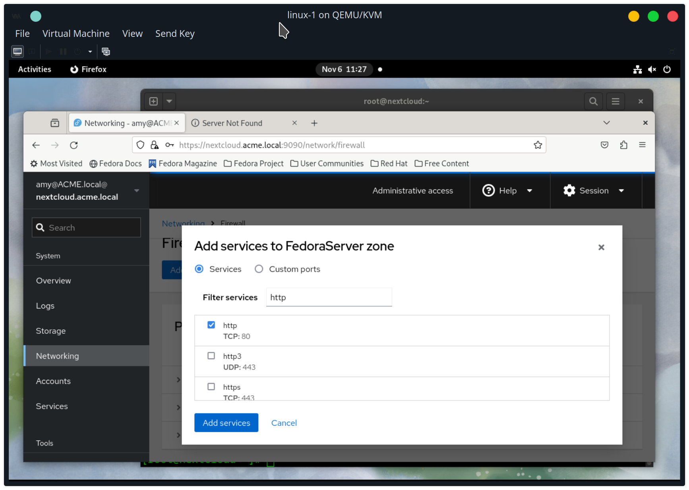

using guide from https://www.atlantic.net/dedicated-server-hosting/how-to-install-nextcloud-on-fedora/

login into linux-1 as amy

ssh into nextcloud server
```
ssh amy@nextcloud
```

become root
```
sudo -i
```

install apache http server
```
dnf install httpd
```

install remi
```
dnf install -y http://rpms.remirepo.net/fedora/remi-release-38.rpm
```

install php version 8.1 with remi
```
dnf module reset php -y
dnf module install php:remi-8.1
```

install php libraries
```
dnf install php php-gd php-curl php-dom php-xml php-simplexml php-mbstring php-json -y
```

enable php extensions
```
yum --enablerepo=remi install php-intl php-zip
```

start apache http server now
```
systemctl enable --now httpd
```

setup database
```
mysql
```

create db
```
create database nextcloud;
create user 'nextcloud'@'localhost' identified by <PASSWORD>;
grant all privileges on nextcloud.* to 'nextcloud'@'localhost';
flush privileges;
exit;
```

TODO: add more commands


Enable port 80 http firewall




