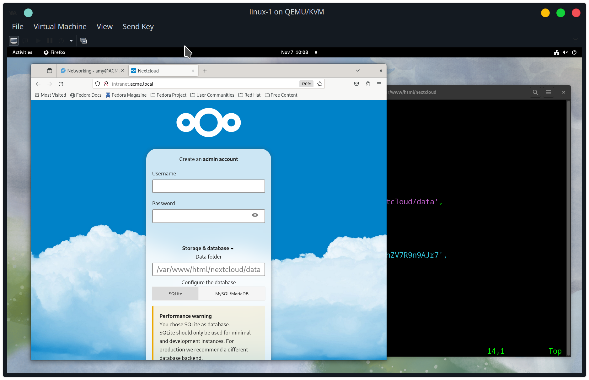
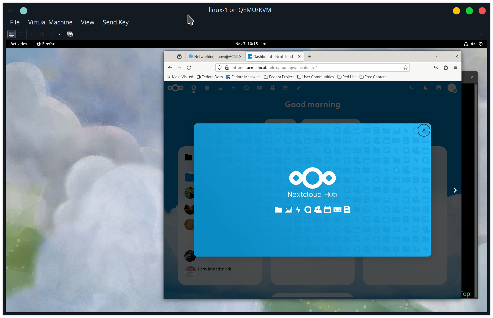
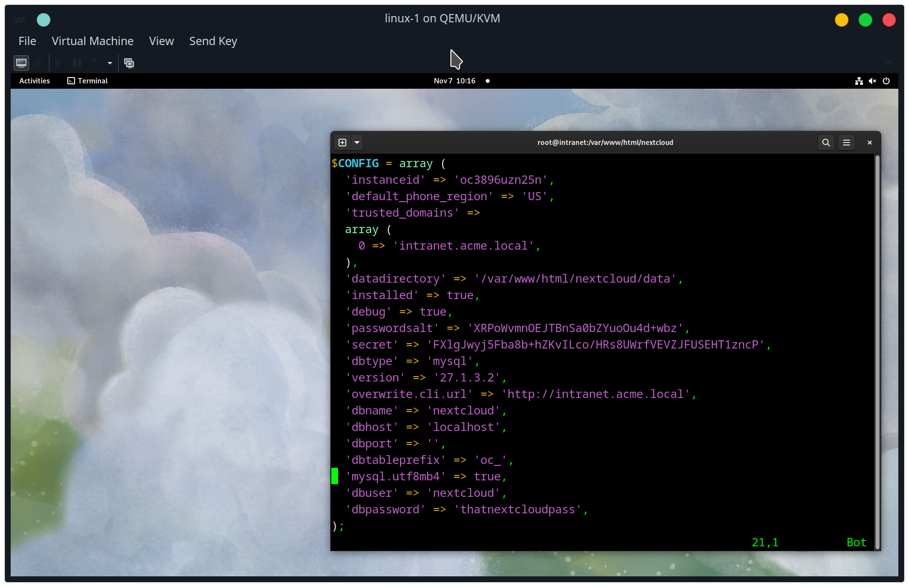

download latest nextcloud (currently it's nextcloud ver 27.1.3)
```
wget https://download.nextcloud.com/server/releases/latest.tar.bz2
```

extract
```
tar -xjf latest.tar.bz2
```

move to /var/www/html
```
mv nextcloud /var/www/html/nextcloud
```

configure apache to run nextcloud app virtual host
create /etc/httpd/conf.d/nextcloud.conf
```
<VirtualHost *:80>
        ServerName intranet.acme.local
        DocumentRoot /var/www/html/nextcloud
        ErrorLog /var/log/httpd/nextcloud_error.log
        CustomLog /var/log/httpd/nextcloud_requests.log combined

        <Directory /var/www/html/nextcloud>
                Options +FollowSymlinks
                AllowOverride All

                <IfModule mod_dav.c>
                        Dav off
                </IfModule>

                SetEnv HOME /var/www/html/nextcloud
                SetEnv HTTP_HOME /var/www/html/nextcloud
        </Directory>
</VirtualHost>
```

create data directory
```
mkdir /var/www/html/nextcloud/data
```

make apache owner of code directory
```
chown -R apache:apache /var/www/html/nextcloud
```

disable SELinux context for nextcloud directory
```
chcon -R -t httpd_sys_content_t /var/www/html/nextcloud
```


Go to the intranet website, there's an error about access to the config directory


create /var/www/html/nextcloud/config/config.php (owned by apache user)
```
sudo touch /var/www/html/nextcloud/config/config.php
sudo chown apache:apache /var/www/html/nextcloud/config/config.php
sudo chmod 777 /var/www/html/nextcloud/config/config.php
```
This lets nextcloud edit the config.php later on during the installation process.

Next, add the following settings to config.php:
```php
<?php
$CONFIG = array (
  'instanceid' => 'oc3896uzn25n',
  'default_phone_region' => 'US',
  'trusted_domains' => 
  array(
    0 => '127.0.0.1',
    1 => '*.acme.local'
  ),
  'datadirectory' => '/var/www/html/nextcloud/data',
  'installed' => false,
  'debug' => true
);
?>
```

Make sure /var/www/html/nextcloud/config/config.php is owned by user apache, and they can write to the file. It will add additional config settings.

Go to the http://intranet.acme.local page and there will be a form to create an account and start installing nextcloud


Enter a new username and password for the new admin account


Click the "Storage & database" link to configure MariaDB instead of SQLite, and enter the database settings from the nextcloud database created earlier


Click install. It might take about 10-30 seconds


Now, NextCloud recommends apps to install. It might take a while to install them.


Now, NextCloud is installed


The config.php was modified by the installation.


Next, I'll use the admin account to setup LDAP integration with the Active Directory domain controller.


from https://docs.nextcloud.com/server/latest/admin_manual/installation/selinux_configuration.html#
SELinux settings commands for directories in /var/www/html/nextcloud:
```
chcon -R -t httpd_sys_content_t /var/www/html/nextcloud/config
semanage fcontext -a -t httpd_sys_rw_content_t '/var/www/html/nextcloud/data(/.*)?'
semanage fcontext -a -t httpd_sys_rw_content_t '/var/www/html/nextcloud/config(/.*)?'
semanage fcontext -a -t httpd_sys_rw_content_t '/var/www/html/nextcloud/apps(/.*)?'
semanage fcontext -a -t httpd_sys_rw_content_t '/var/www/html/nextcloud/.htaccess'
semanage fcontext -a -t httpd_sys_rw_content_t '/var/www/html/nextcloud/.user.ini'
semanage fcontext -a -t httpd_sys_rw_content_t '/var/www/html/nextcloud/3rdparty/aws/aws-sdk-php/src/data/logs(/.*)?'

restorecon -Rv '/var/www/html/nextcloud/'
```