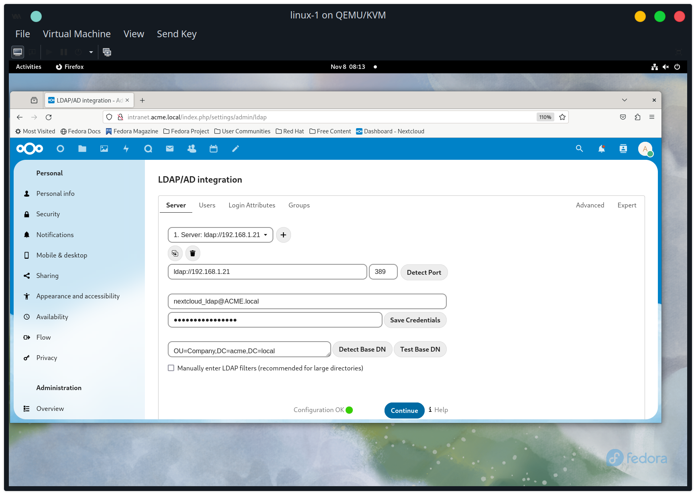
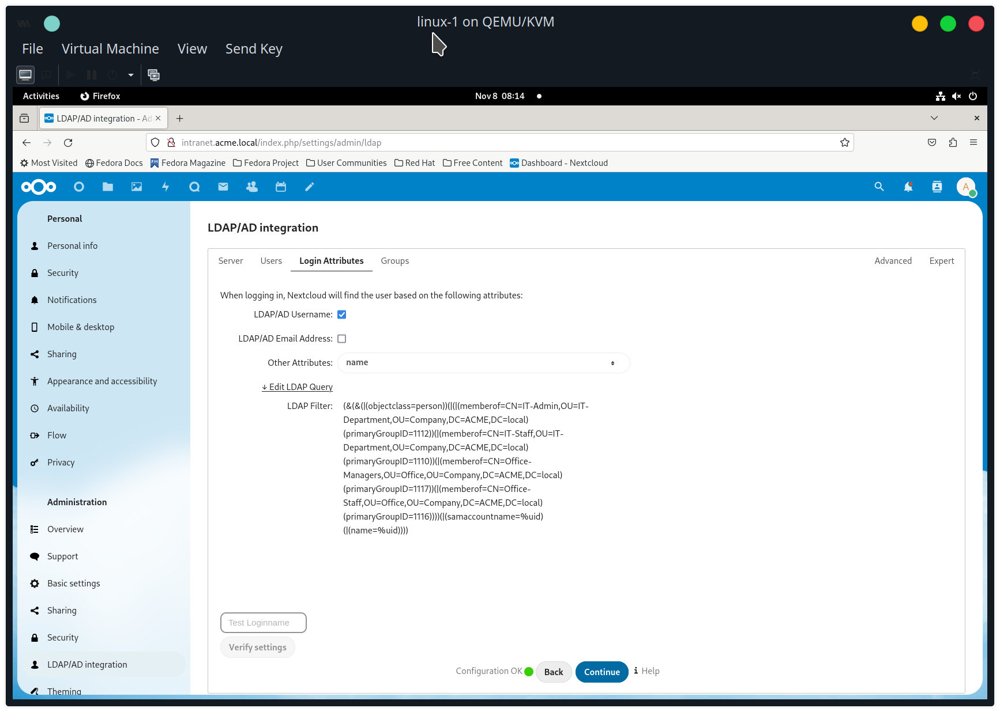
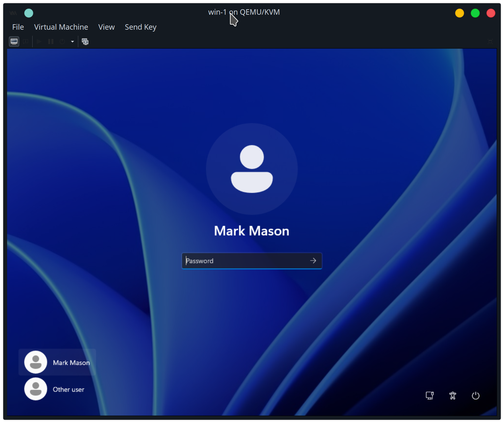
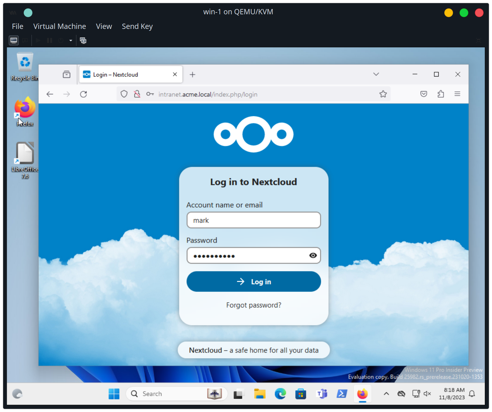
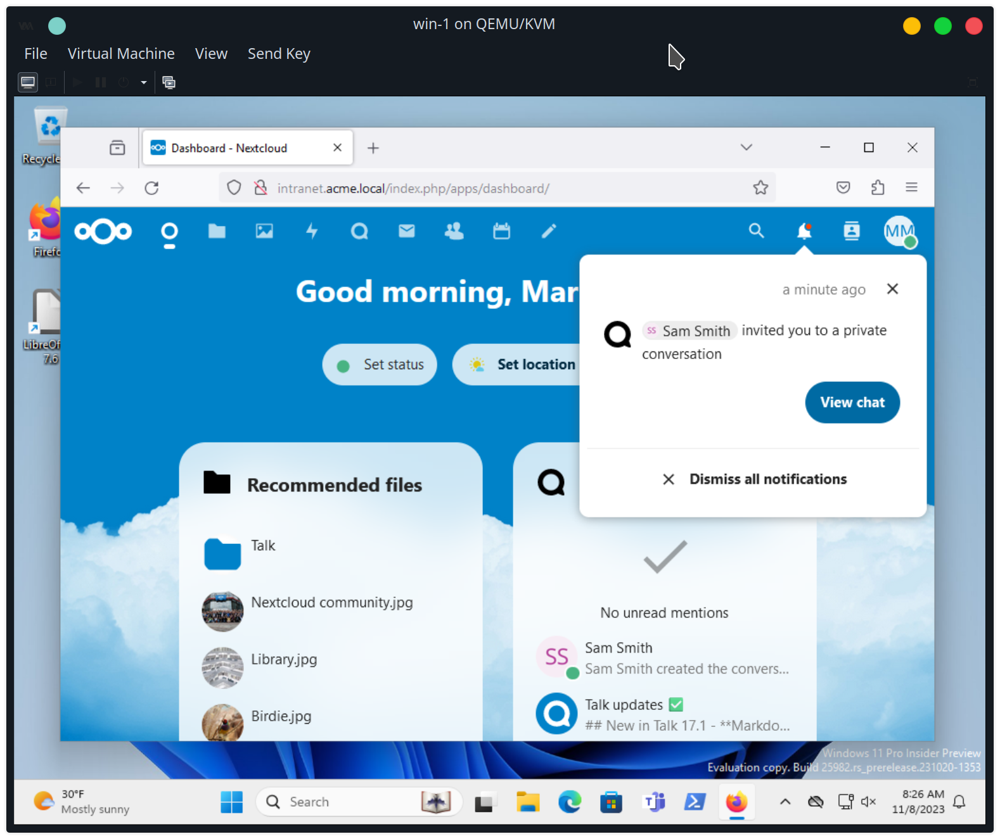
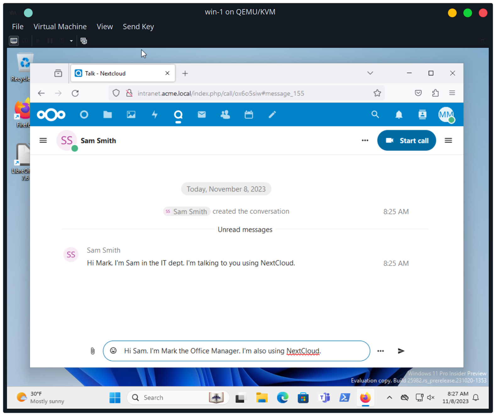
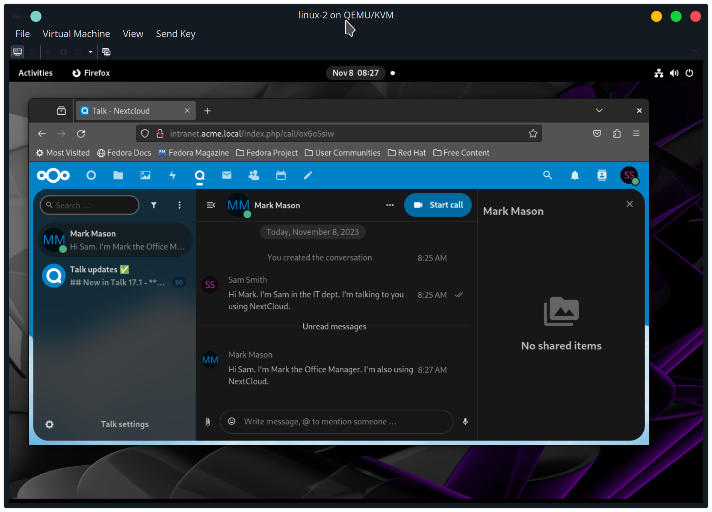
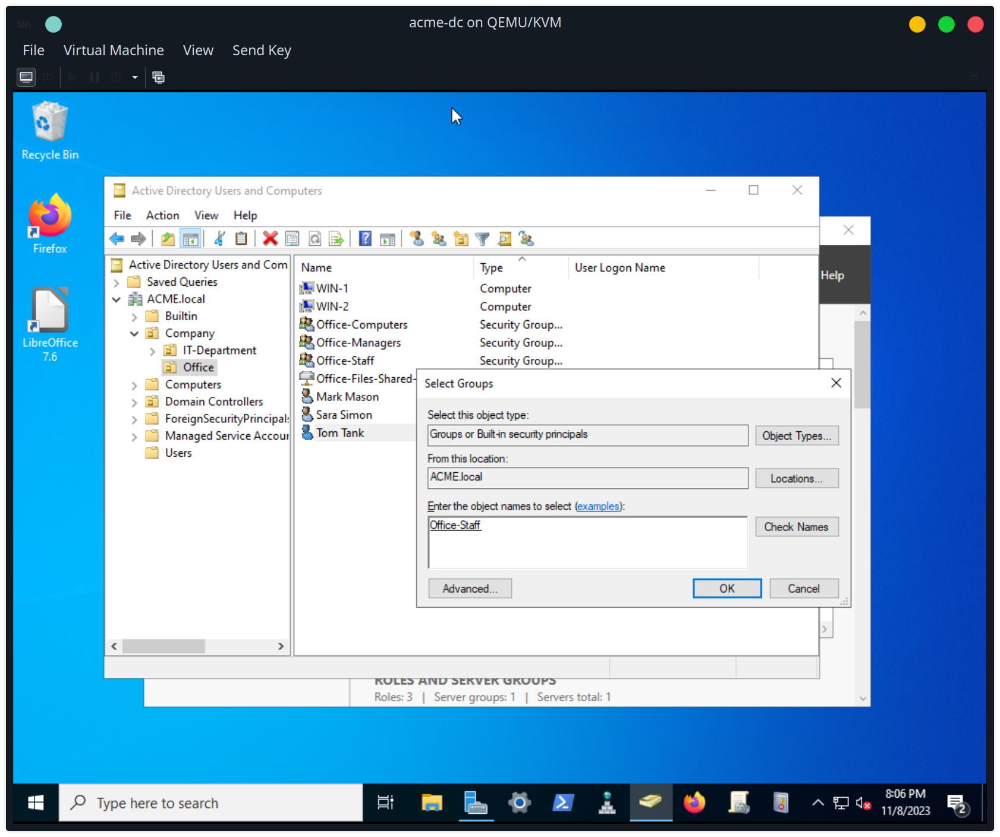

create service user nextcloud_ldap


make it member of Administrators


go to nextcloud ldap settings


SELinux blocks NextCloud (using the httpd service) from connecting to the domain controller at 192.168.1.21 via LDAP (port 389). The `/var/log/audit/audit.log` file will have lines like this:
```
ype=AVC msg=audit(1699500487.131:125): avc:  denied  { name_connect } for  pid=879 comm="php-fpm" dest=389 scontext=system_u:system_r:httpd_t:s0 tcontext=system_u:object_r:ldap_port_t:s0 tclass=tcp_socket permissive=0
```

You can also see the SELinux access control blocking it by going to the `intranet` admin console at `https://intranet.acme.local:9090/selinux`.


One solution is to allow httpd to ldap connect:
```
setsebool -P httpd_can_connect_ldap 1
```


use service user


limit to user security groups


use username and name attributes


include groups


users and groups added from domain


login as mark from win-1




login as sam from linux-2


private chat between sam and mark





create new user called tom


add tom to office-staff


tom is included in NextCloud


