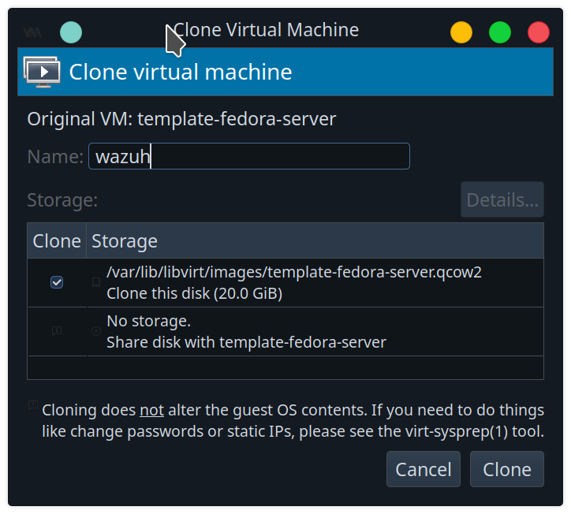
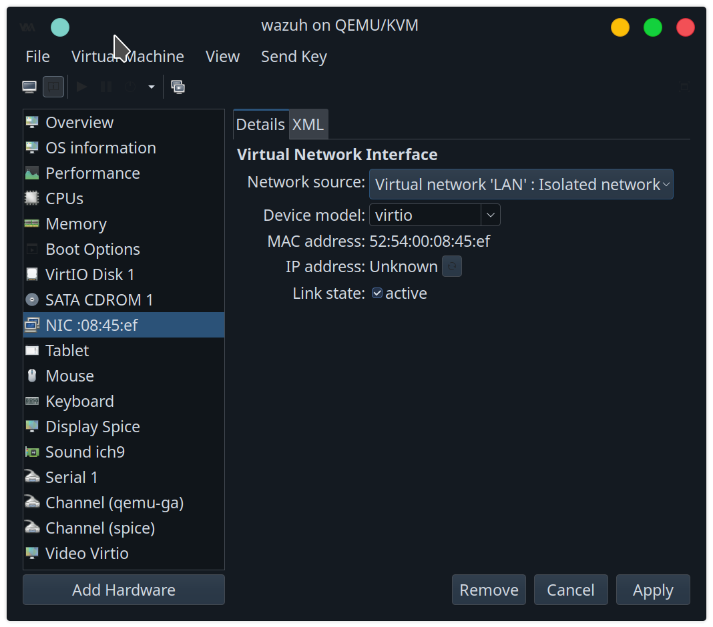
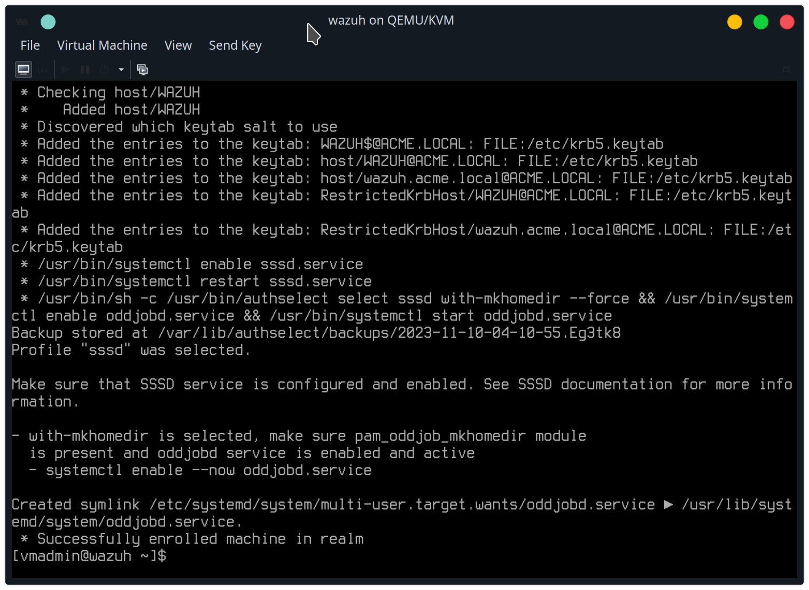
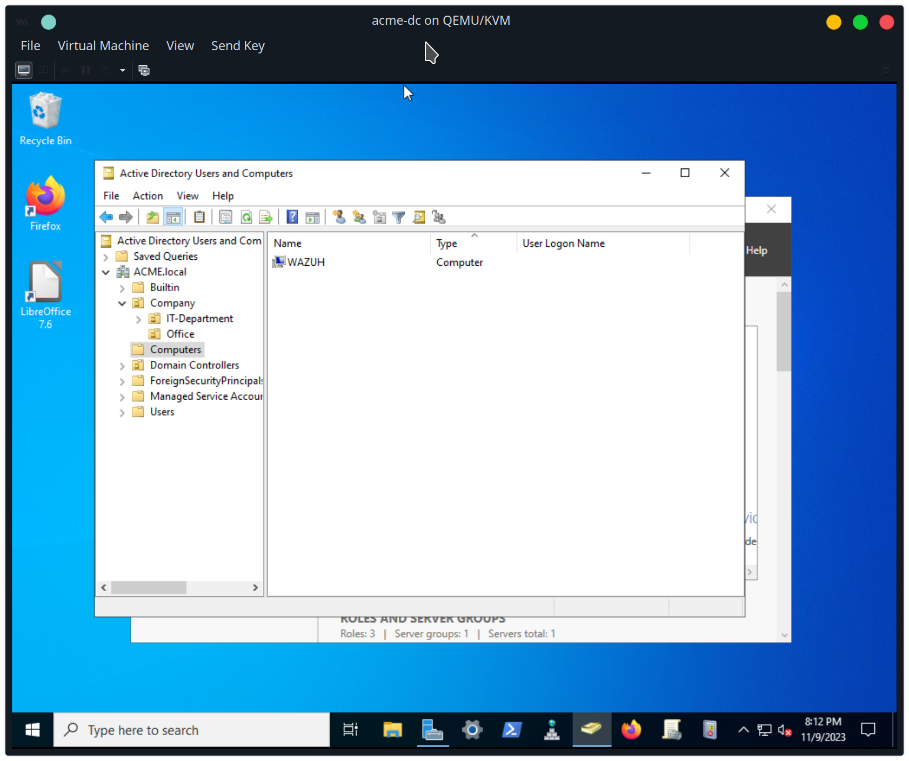
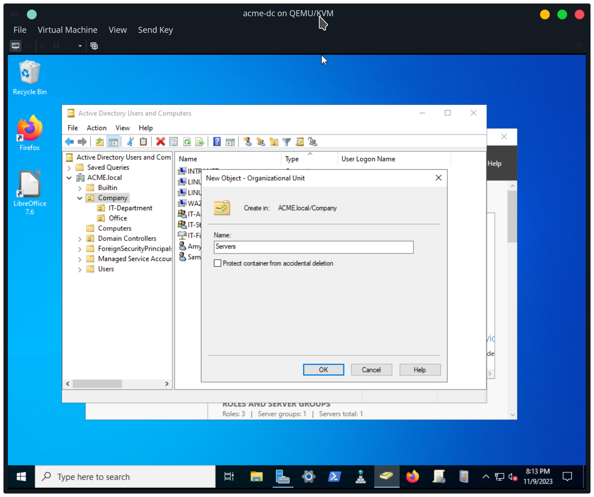
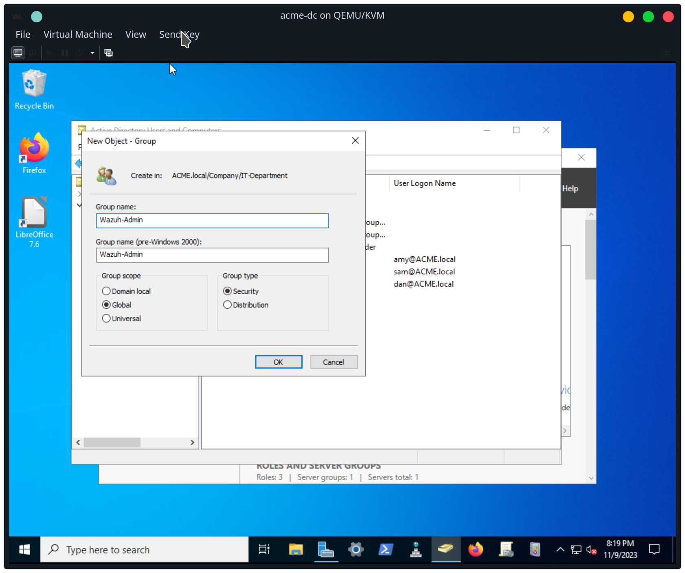
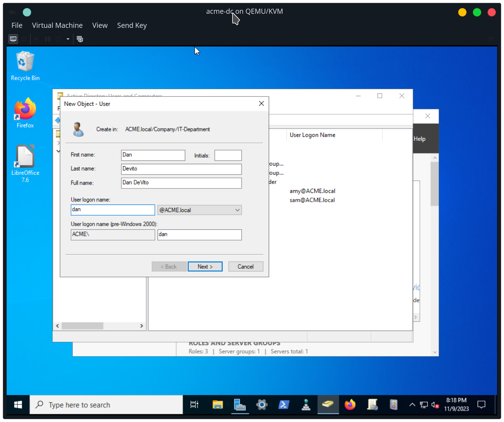
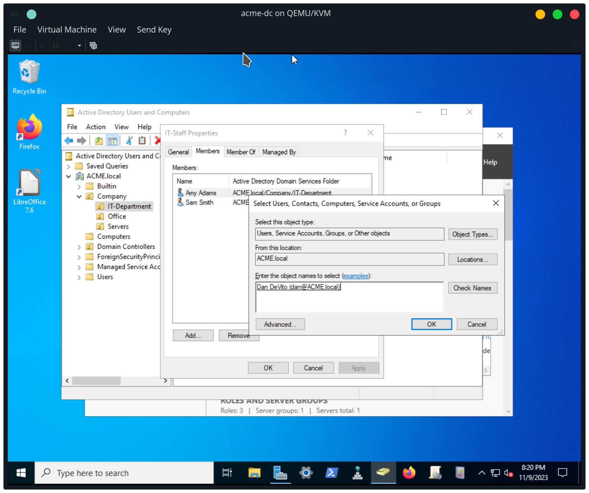
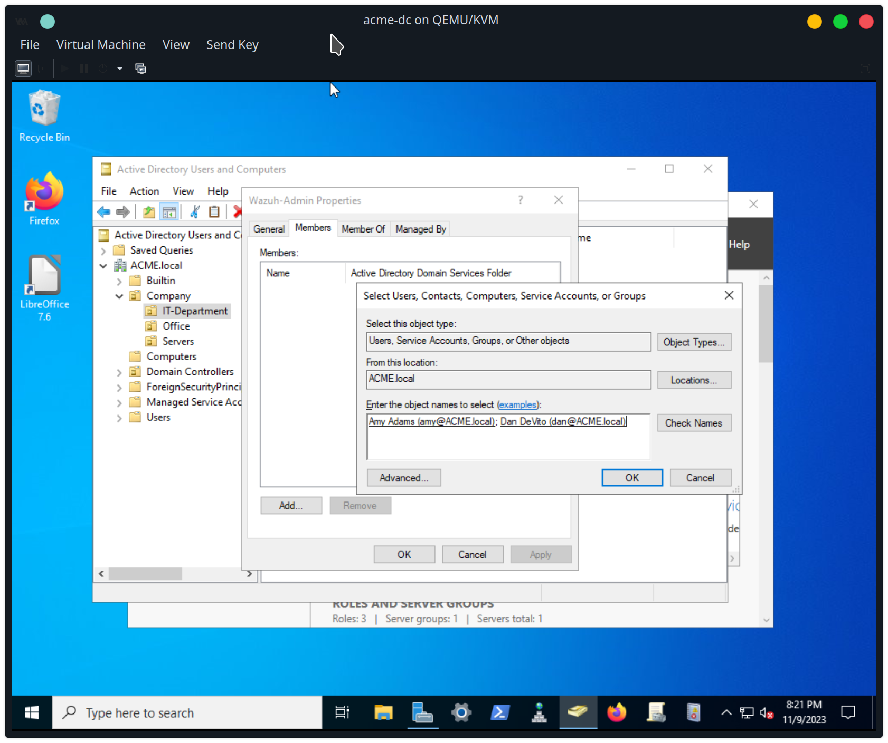

set hostname to wazuh
```
sudo hostnamectl set-hostname wazuh.acme.local
```

set static IP 192.168.1.44, and gateway 192.168.1.1
```
sudo nmcli con modify 'enp1s0' ifname enp1s0 ipv4.method manual ipv4.addresses 192.168.1.44/24 gw4 192.168.1.1
sudo nmcli con up 'enp1s0'
```

add wazuh to acme.local domain



create new organization unit for servers


move intranet and wazuh servers to Servers OU


create new security group called wazuh-admin


create new user called dan


add dan to IT-Staff group



add amy and dan to Wazuh-Admin group



give Wazuh-Admin group full sudo privilege on wazuh server by adding this to new /etc/sudoers.d/wazuh_admin_sudo file:
```
%wazuh-admin@acme.local ALL=(ALL) ALL
```


