I'm going to add an Ubuntu Server to the SOC network, and install Wazuh on it.

I'll create the wuzah VM and install Ubuntu Server
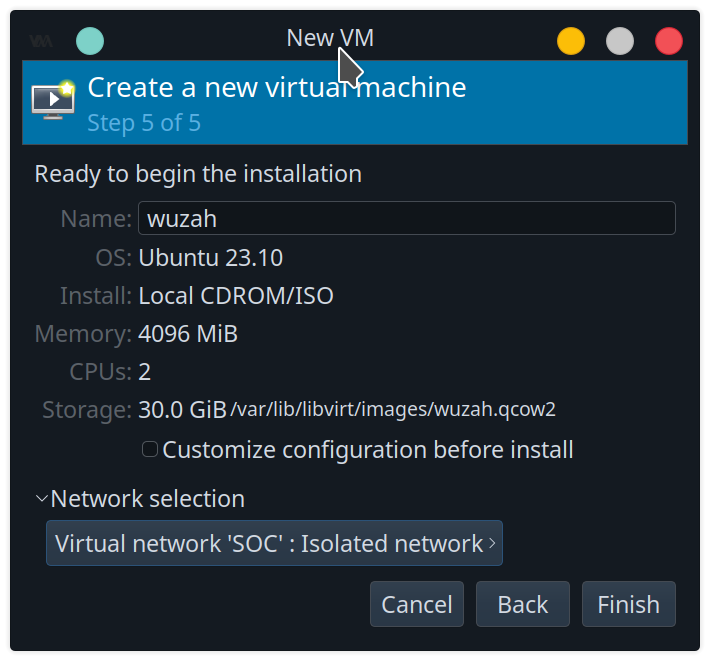


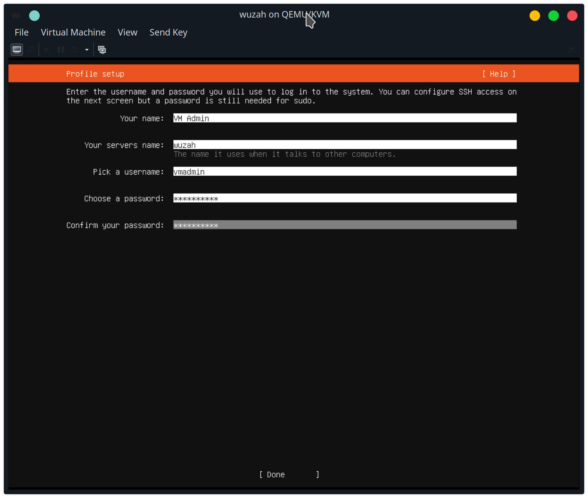
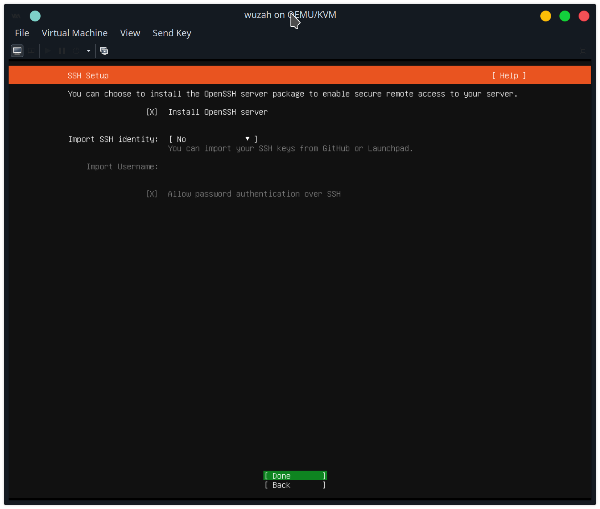


Follow the same steps to join this wuzah VM (Ubuntu Server) as with the previous soc-analyst

Except 
On the wazuh VM, give full sudo privileges to the domain group SOC-Admin by creating the sudo file /etc/sudoers.d/soc_admin_sudo:
```
%soc-admin@abc.local ALL=(ALL) ALL
```

Add wazuh static IP 192.168.2.10 to domain controller's DNS Server

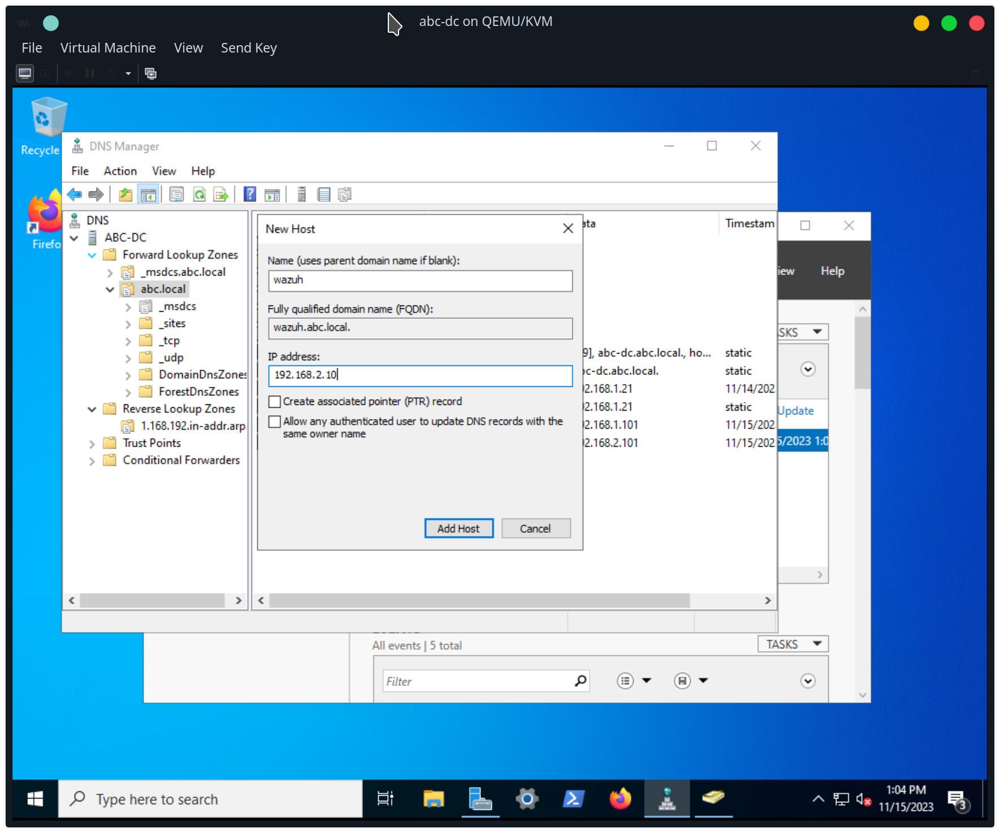


Install wuzah using the "all-in-one" guide https://documentation.wazuh.com/current/quickstart.html

Log into the linux-1 VM as adam, and SSH into wazuh as adam


download the installation shell and run it
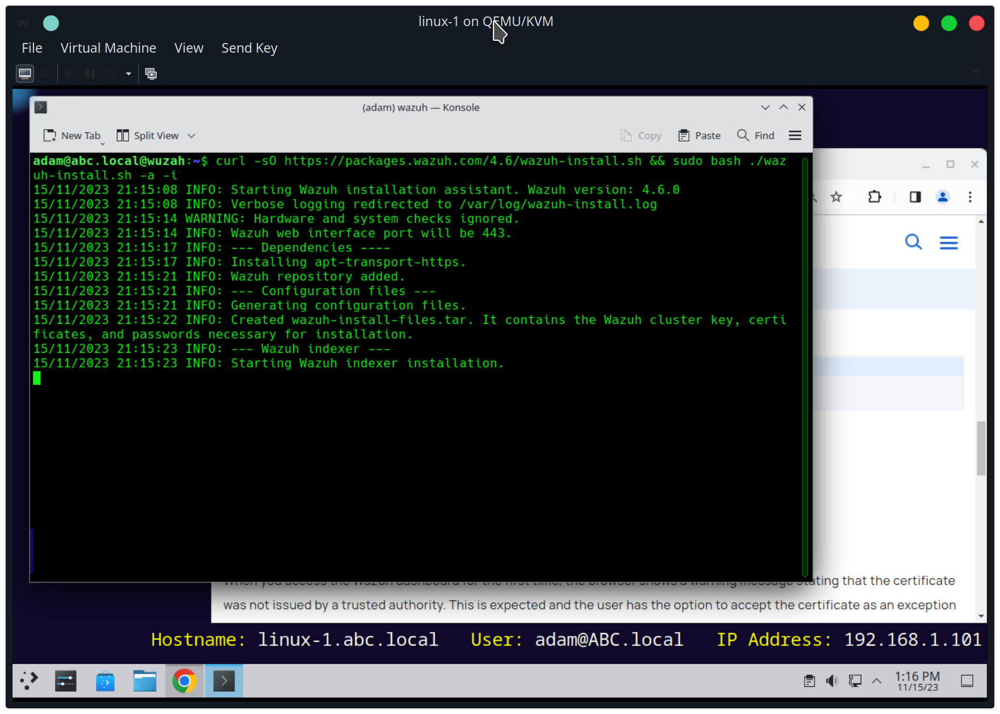

visit https://wazuh.abc.local:443

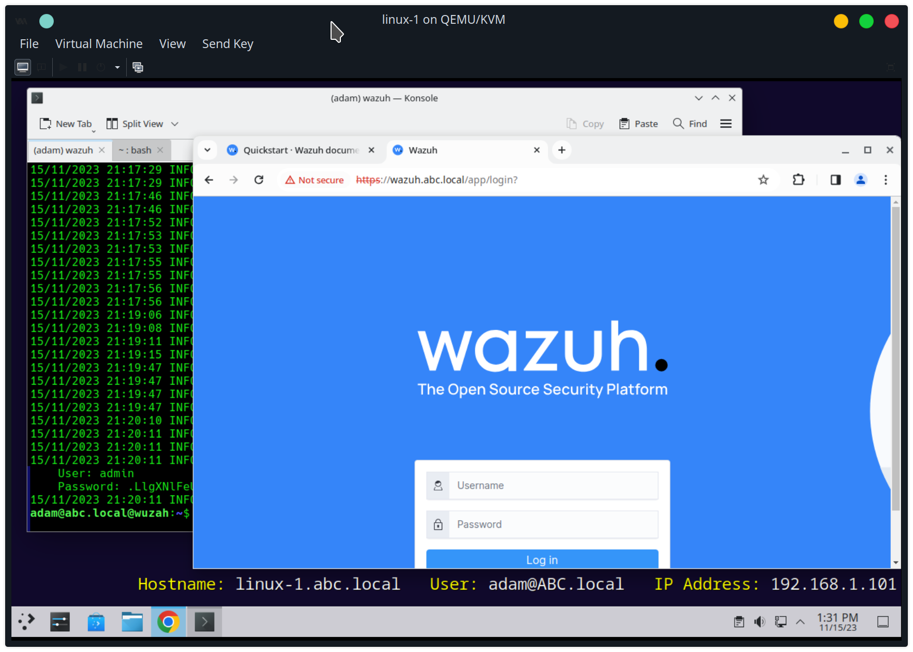
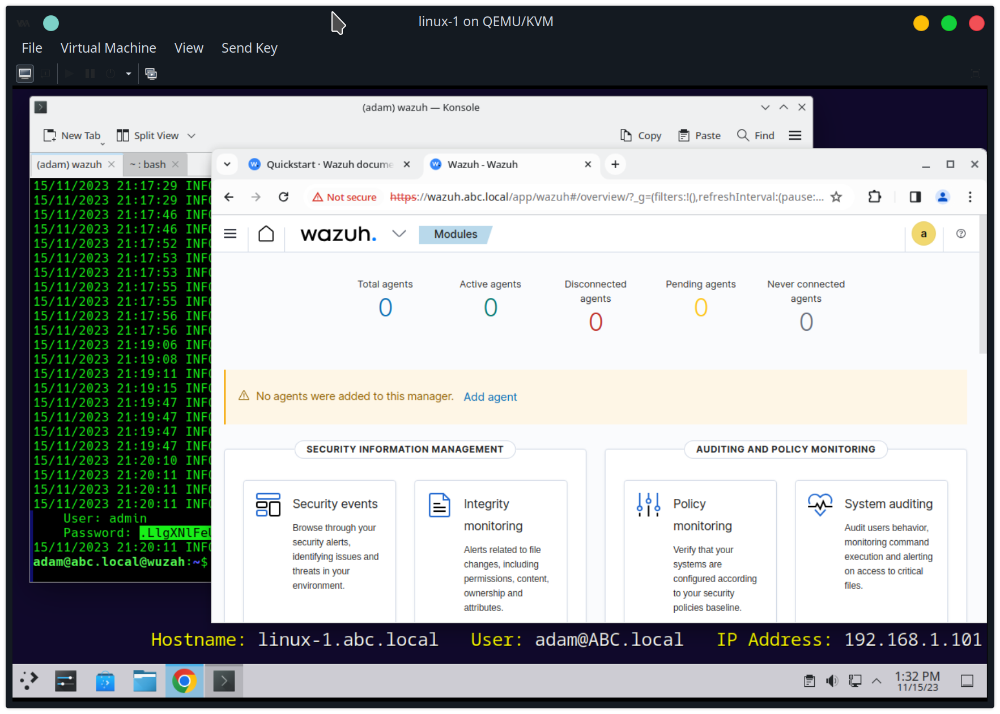

Install Windows agent on domain controller abc-dc
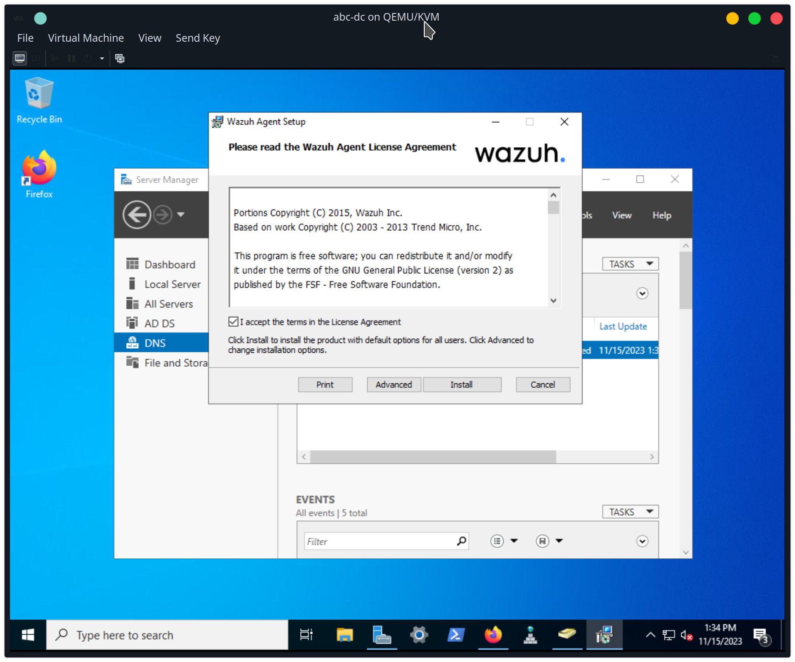
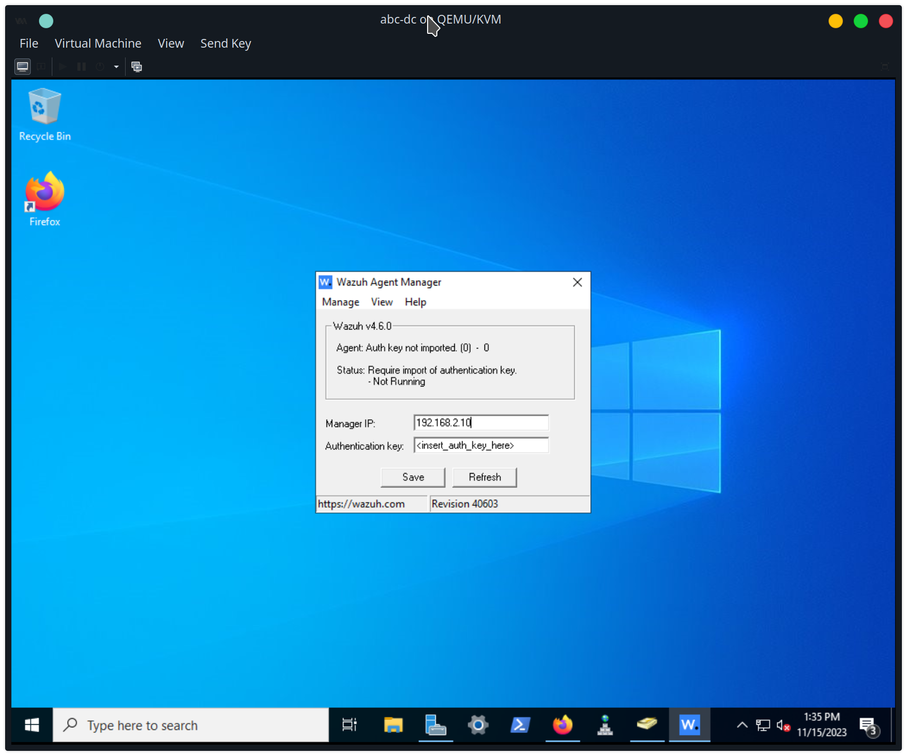
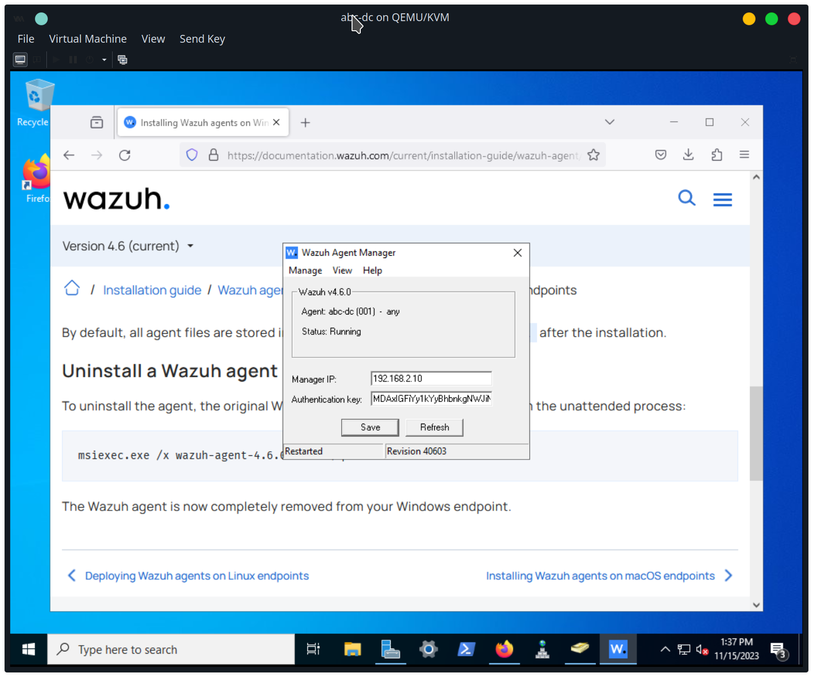

Windows events from domain controller abc-dc
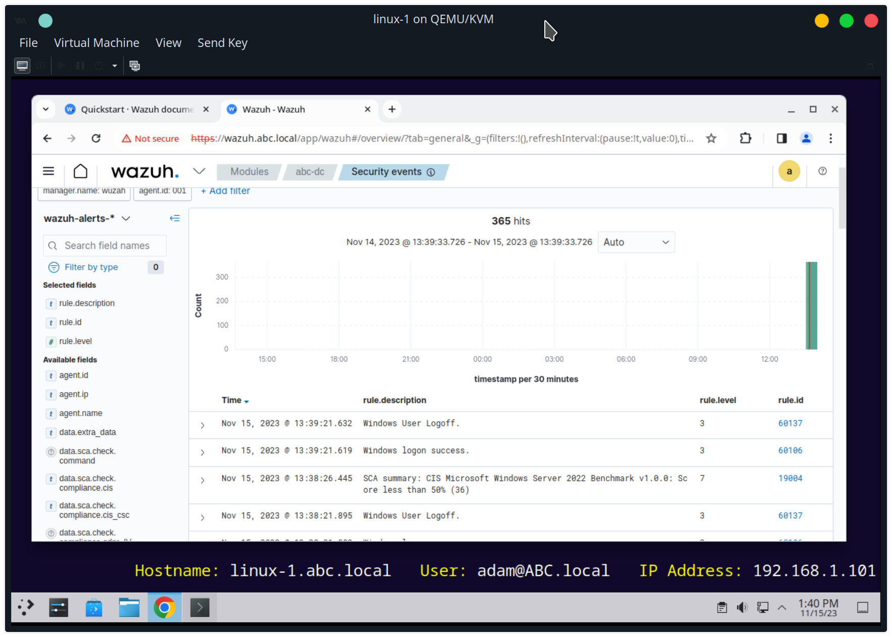
