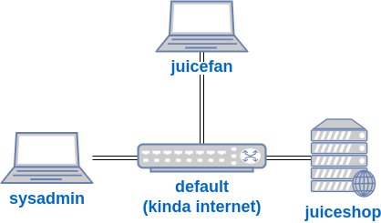

## Intro

## Why install a vulnerable web application?

## VM Lab Environment
Here's a diagram of what I'll have in the lab:

### Virtual Machines
I'm going to have three VMs.

#### 1. juiceshop - Arch Linux desktop
The `juiceshop` VM will be running the vulnerable juice-shop web application. Because it's just running a web server, I won't run the KDE Plasma windows manager.
- I'll disable SDDM, so it starts in command line mode.
- I'll setup OpenSSH server so that it can be managed by other VMs.
- I'll install NodeJS, and install the juice-shop web application from its GitHub repository.
- I'l create a systemd service to run the juice-shop web application, and modify the web application configuration to run on port 80 (HTTP).

#### 2. sysadmin - Arch Linux desktop
The `sysadmin` VM will be a Linux desktop I use to manage the `juiceshop` web server via SSH. I'll be acting like the administrator, using their personal computer to manage the web server.

#### 3. juicefan - Windows 11 desktop
The `juicefan` VM will be a Windows desktop that acts like a user/customer for the `juiceshop` web server VM. 

### Virtual Networks
I'm going to mostly use the libvirt default virtual network again. It has an IP address of `192.168.122.1`, with a DHCP range of `192.168.122.100` to `192.168.122.254`.

In this lab, I'll pretend like the default virtual network is like the internet, connecting the machines that would be in different parts of the world on different networks. I think this is an inaccurate representation of users and web servers. For now, I'm not going to add the complexity of separate networks and routers. 

### Host Machine
I'm using the [virt-manager](https://virt-manager.org/) for managing VMs. My host computer is Arch Linux, with the KDE Plasma windows manager. I also use the [libvirt](https://libvirt.org/) API to manage virtual networks.